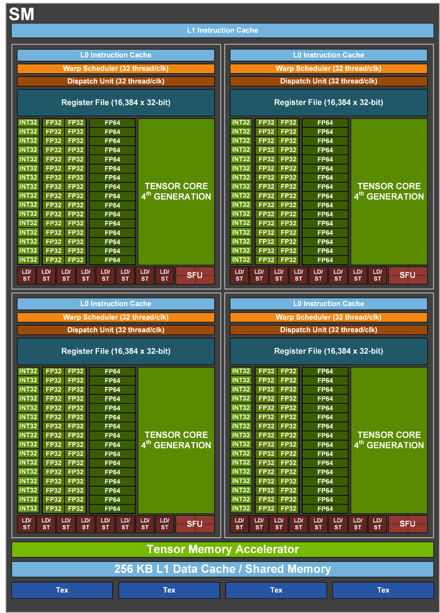

## SM (Streaming Multiprocessor)
Architecture of a SM in a H100 GPU ([source](https://resources.nvidia.com/en-us-hpc-ai/nvidia-hopper-architecture)):

Starting with the Volta architecture—and continuing through Turing, Ampere, Ada Lovelace, and Hopper—NVIDIA divides each SM into **four distinct processing blocks** (often called sub-cores or sub-partitions).
