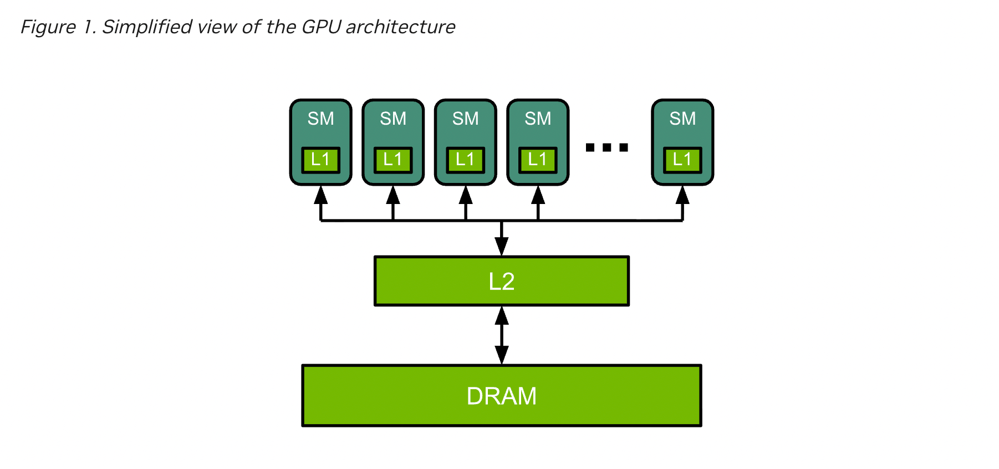
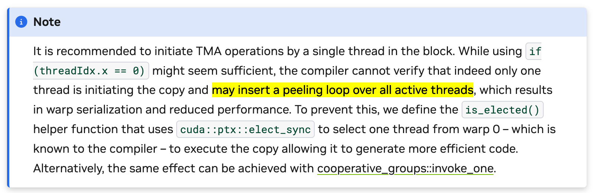

# L1 and L2 and HBM
Architecture:

Ref: https://docs.nvidia.com/deeplearning/performance/dl-performance-gpu-background/index.html#gpu-arch

At a high level, NVIDIA® GPUs consist of a number of Streaming Multiprocessors (SMs), on-chip L2 cache, and high-bandwidth DRAM. Arithmetic and other instructions are executed by the SMs; data and code are accessed from DRAM via the L2 cache. As an example, an NVIDIA A100 GPU contains 108 SMs, a 40 MB L2 cache, and up to 2039 GB/s bandwidth from 80 GB of HBM2 memory.

**L1 note:**<br/>
On some GPU devices: the L1 cache and shared memory may use the same hardware resources.<br/>
Ref: https://docs.nvidia.com/cuda/cuda-runtime-api/group__CUDART__DEVICE.html#group__CUDART__DEVICE_1g6c9cc78ca80490386cf593b4baa35a15

# Memory Address Alignment
Ref: https://docs.nvidia.com/cuda/cuda-c-best-practices-guide/
>Memory allocated through the CUDA Runtime API, such as via cudaMalloc(), is guaranteed to be aligned to at least 256 bytes. 

# TensorFlow and CUDA
```Bash
export TF_CUDA_COMPUTE_CAPABILITIES="7.5,8.0,8.6,8.9,9.0"
```

# TMA operations and if (threadIdx.x == 0)
https://docs.nvidia.com/cuda/cuda-programming-guide/04-special-topics/async-copies.html

<br/>
>It is recommended to initiate TMA operations by a single thread in the block. While using if (threadIdx.x == 0) might seem sufficient, the compiler cannot verify that indeed only one thread is initiating the copy and may insert a peeling loop over all active threads, which results in warp serialization and reduced performance. To prevent this, we define the is_elected() helper function that uses cuda::ptx::elect_sync to select one thread from warp 0 – which is known to the compiler – to execute the copy allowing it to generate more efficient code. Alternatively, the same effect can be achieved with cooperative_groups::invoke_one.

# Warp ID and Lane
### Warp ID
Within a block, each warp is numbered in order.
- Warp ID = which warp in the block this thread belongs to.
- All threads in the same warp share the same warp ID.
- Computed by:
  ```MLIR
  warp_id = threadIdx.x / 32;
  ```
<br/>

### Lane (or Lane ID)
Inside a warp, each thread has a position known as its lane or lane ID.
- Always an integer from 0 to 31.
- Common calculation:
  ```MLIR
  lane = threadIdx.x % 32;
  ```
<br/>

### Example: blockDim.x = 128
| threadIdx.x | warp_id | lane |
| ----------- | ------- | ---- |
| 0           | 0       | 0    |
| 1           | 0       | 1    |
| ...         | ...     | ...  |
| 31          | 0       | 31   |
| 32          | 1       | 0    |
| ...         | ...     | ...  |
| 63          | 1       | 31   |
| 64          | 2       | 0    |
| ...         | ...     | ...  |
| 127         | 3       | 31   |
