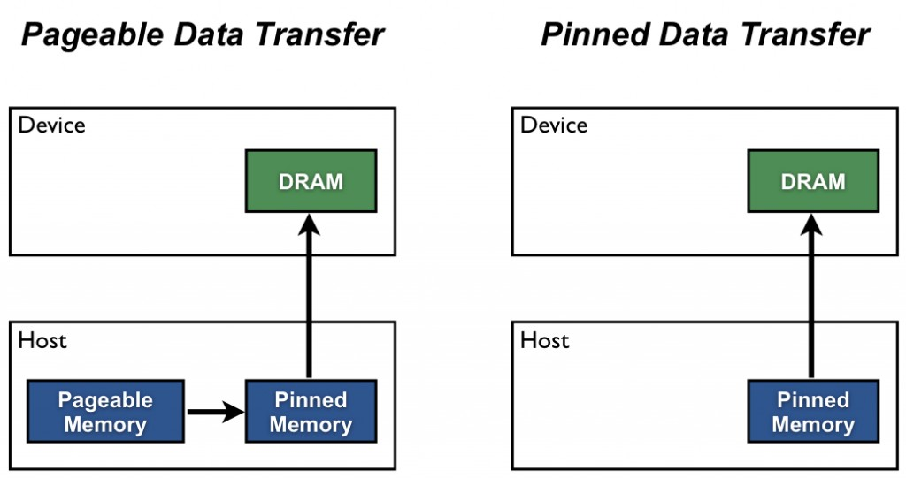

# Pinned Host Memory
https://developer.nvidia.com/blog/how-optimize-data-transfers-cuda-cc/

By default, host memory allocated via standard functions like malloc() or new is pageable, meaning the OS can move or swap it to disk.

The GPU cannot access data directly from pageable host memory, so when a data transfer from pageable host memory to device memory is invoked, the CUDA driver must first allocate a temporary page-locked, or "pinned", host array, copy the host data to the pinned array, and then transfer the data from the pinned array to device memory (initiate the **DMA** transfer to the GPU), as illustrated below.



As you can see in the figure, pinned memory is used as a staging area for transfers from the device to the host. We can avoid the cost of the transfer between pageable and pinned host arrays by directly allocating our host arrays in pinned memory. Allocate pinned host memory in CUDA C/C++ using `cudaMallocHost()`, and deallocate it with `cudaFreeHost()`. It is possible for pinned memory allocation to fail, so you should always check for errors. The following code excerpt demonstrates allocation of pinned memory with error checking.

```cpp
cudaError_t status = cudaMallocHost((void**)&h_aPinned, bytes);
if (status != cudaSuccess)
  printf("Error allocating pinned host memory\n");
```

Data transfers using host pinned memory use the same `cudaMemcpy()` syntax as transfers with pageable memory. We can use the following `bandwidthtest` program ([also available on Github](https://github.com/NVIDIA-developer-blog/code-samples/blob/master/series/cuda-cpp/optimize-data-transfers/bandwidthtest.cu)) to compare pageable and pinned transfer rates.
