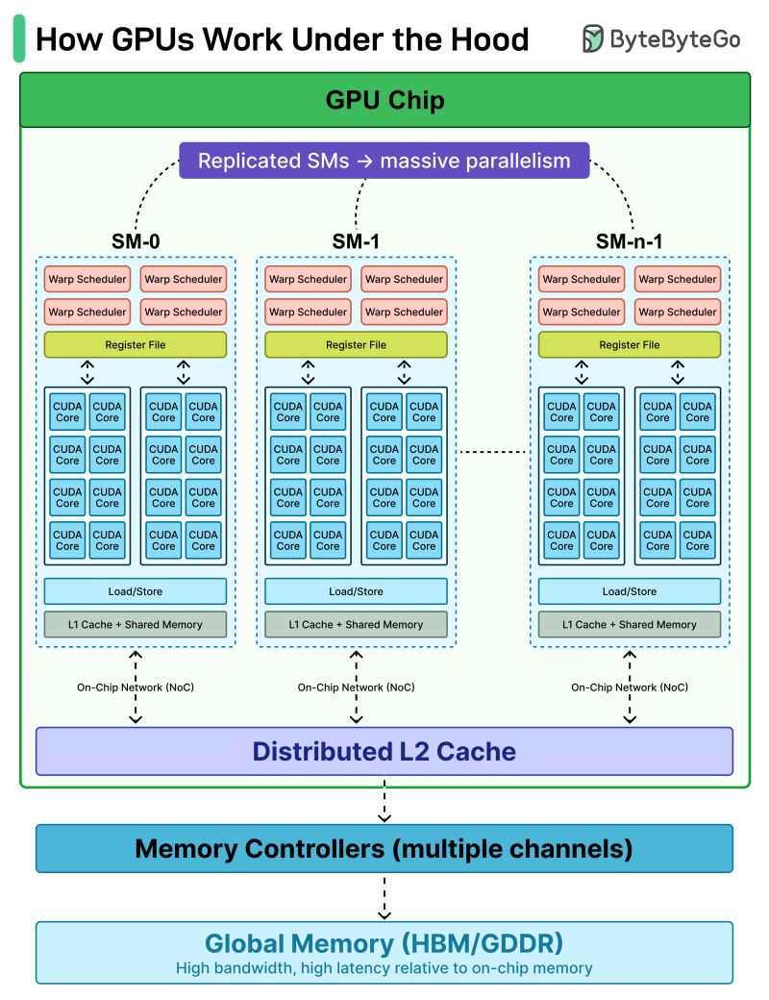

# SRAM (Static RAM) vs DRAM (Dynamic RAM)
- SRAM uses 4 to 6 transistors per bit in a flip-flop circuit, while DRAM uses just one transistor and one capacitor per bit.
- Speed: SRAM has very low latency and is significantly faster than DRAM.
- Refreshing: SRAM retains data as long as power is on without needing updates; DRAM leaks charge and must be refreshed thousands of times per second.
- Density & Cost: DRAM is much denser (fits more memory in less space) and costs less per bit, making it ideal for large capacities.
- Common Use: SRAM is used for high-speed CPU cache memory (L1, L2, L3), while DRAM is used for main system memory (RAM).

# GPU Cache Hierarchy

* **L1 Cache (Private):** Each Streaming Multiprocessor (SM) has its own L1 cache. It is incredibly fast but only serves the threads running on that specific SM.
* **L2 Cache (Shared):** A larger, unified L2 cache sits between the SMs and the global memory (VRAM). All SMs share this cache.
* **Global Memory (VRAM):** The main pool of high-capacity memory.

# Cache Coherence
NVIDIA GPUs do not have full, automatic hardware cache coherence** for global memory across their L1 caches like modern CPUs do.

Instead of relying on hardware protocols (like MESI) that automatically keep all caches synchronized, NVIDIA GPUs use a **software-managed, relaxed memory consistency model** combined with a shared L2 cache.

### The Coherence Problem

Because the L2 cache is shared, it is inherently coherent across the entire GPU. If all memory requests bypassed L1 and went straight to L2, there would be no coherence issue.

However, because each SM has its own L1 cache, a data race can occur. If SM A reads a variable from global memory, it gets cached in SM A's L1. If SM B then overwrites that variable in global memory (updating the L2), SM A's L1 cache does not automatically get notified. SM A will continue to read the stale, outdated value from its own L1 cache.

### Why Not Use CPU-Style Coherence?

CPUs use complex hardware protocols (like bus snooping or directory-based MESI protocols) to ensure that when one core modifies a variable, all other cores immediately invalidate their cached copies of it.

GPUs cannot do this because of their scale. A modern CPU might have 16 or 32 cores, while a modern NVIDIA GPU has over a hundred SMs and tens of thousands of concurrent threads. If the GPU had to broadcast invalidation signals across the chip every time a thread updated memory, the interconnect would be completely paralyzed by coherence traffic.

### How NVIDIA Manages Memory Consistency

Because the hardware does not automatically synchronize the L1 caches, the burden is placed on the programmer and the compiler to manage it explicitly.

* **Bypassing L1 (Volatile/Atomics):** If multiple SMs need to communicate via global memory, the programmer can use the `volatile` keyword or atomic operations. This instructs the compiler to skip or invalidate the L1 cache for that specific variable, forcing the reads and writes to go directly to the shared, coherent L2 cache.
* **Memory Fences (Barriers):** CUDA provides memory fence instructions (like `__threadfence()`). A memory fence stalls the thread until all its previous global memory writes are guaranteed to be visible to all other SMs (usually by flushing the local cache to L2).
* **Scoped Memory Model:** In modern architectures (Volta and newer), NVIDIA uses a "scoped" memory consistency model. When you synchronize threads, you specify the "scope" of the synchronization (e.g., Thread Block, GPU Device, or System). The hardware only flushes and invalidates caches to the level necessary to guarantee coherence for that specific scope, avoiding full-chip performance penalties.

# Read-Only Cache

