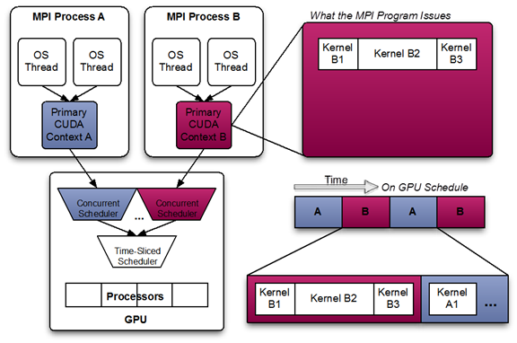
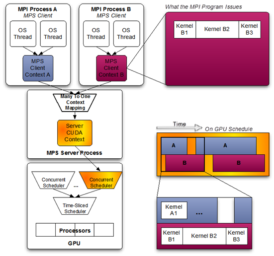

# MPS
## Background
- CUDA streams are mapped onto distinct work queues on the GPU by the driver.
- Work launched to the compute engine from work queues belonging to the same CUDA context can execute concurrently on the GPU.
- The GPU also has a time sliced scheduler to schedule work from work queues belonging to different CUDA contexts.
- Work launched to the compute engine from work queues belonging to different CUDA contexts cannot execute concurrently.

The following diagram shows a likely schedule of CUDA kernels when running an MPI application consisting of multiple OS processes without MPS. Note that while the CUDA kernels from within each MPI process may be scheduled concurrently, each MPI process is assigned a serially scheduled time-slice on the whole GPU.



<br/>

With MPS, different MPS client contexts can be fused into a single MPS server CUDA context, enabling work from different processes to execute concurrently on the same GPU as shown in the following diagram:



## Useful Commands
```Bash
# Get MPS server PID
echo get_server_list | nvidia-cuda-mps-control

# List MPS Client PIDs
echo "get_client_list <MPS_SERVER_PID>" | nvidia-cuda-mps-control
echo "get_client_list 151" | nvidia-cuda-mps-control

# In k8s env
echo get_device_client_list | nvidia-cuda-mps-control
```
