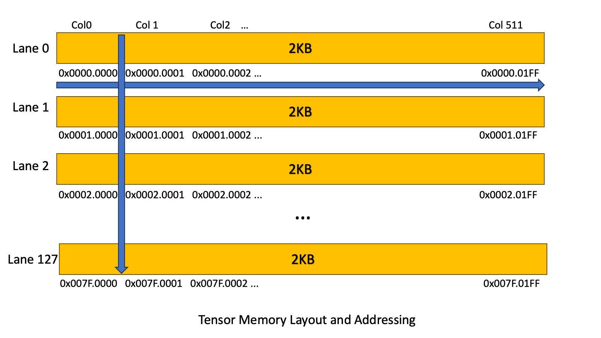

<!-- TOC START -->
- [Register File](#register-file)
  - [How 64-bit values work (Register Pairing)](#how-64-bit-values-work-register-pairing)
  - [Register Allocation](#register-allocation)
    - [Line-by-Line Breakdown](#line-by-line-breakdown)
    - [The "Register Reallocation" Concept](#the-register-reallocation-concept)
    - [Why is this used?](#why-is-this-used)
    - [**Key Implications of Using 240 Registers**](#key-implications-of-using-240-registers)
      - [**1. This is Near the Hardware Limit**](#1-this-is-near-the-hardware-limit)
      - [**2. Where do these registers come from?**](#2-where-do-these-registers-come-from)
      - [**3. The "Producer-Consumer" Pattern**](#3-the-producer-consumer-pattern)
    - [**Summary Table**](#summary-table)
  - [What a clock cycle *really* is in hardware](#what-a-clock-cycle-really-is-in-hardware)
    - [1. The Clock Cycle as a "Time Budget"](#1-the-clock-cycle-as-a-time-budget)
    - [2. What Happens Inside "One Cycle" for a Register File?](#2-what-happens-inside-one-cycle-for-a-register-file)
- [Shared Memory](#shared-memory)
    - [The Optimization Strategy (Why it matters)](#the-optimization-strategy-why-it-matters)
      - [The Conversion: `cvta`](#the-conversion-cvta)
- [Kernel params](#kernel-params)
- [%ctaid](#ctaid)
- [bar.sync and barrier.sync](#barsync-and-barriersync)
    - [What It Does](#what-it-does)
- [.sync.aligned](#syncaligned)
- [Load](#load)
- [Store](#store)
- [Square backets](#square-backets)
    - [The "Load" Case](#the-load-case)
    - [The "Store" Case](#the-store-case)
- [Logical Shift](#logical-shift)
- [Arithmetic Right Shift](#arithmetic-right-shift)
- [elect.sync](#electsync)
    - [Breakdown of the Instruction: `elect.sync %r137|%p19, -1;`](#breakdown-of-the-instruction-electsync-r137p19-1)
    - [Behavior and Semantics](#behavior-and-semantics)
    - [Example Use Case](#example-use-case)
- [TMA Load](#tma-load)
- [shfl.sync](#shflsync)
    - [Breakdown of the Instruction](#breakdown-of-the-instruction)
    - [What It Does](#what-it-does)
    - [Use Cases](#use-cases)
    - [Requirements and Notes](#requirements-and-notes)
- [bfe](#bfe)
    - [Breakdown of the Instruction](#breakdown-of-the-instruction)
    - [What It Does](#what-it-does)
    - [Use Cases](#use-cases)
    - [Requirements and Notes](#requirements-and-notes)
- [Tensor Memory](#tensor-memory)
- [brx.idx](#brxidx)
    - [The Target List Declaration](#the-target-list-declaration)
    - [The Branch Instruction](#the-branch-instruction)
    - [How it works in practice](#how-it-works-in-practice)
    - [Summary](#summary)
- [.sync.aligned modifier](#syncaligned-modifier)
    - [Meaning of `.sync` (Synchronization)](#meaning-of-sync-synchronization)
    - [Meaning of `.aligned` (Program Counter Alignment)](#meaning-of-aligned-program-counter-alignment)
    - [Program Counter (PC)](#program-counter-pc)
- [mul.lo.s32](#mullos32)
    - [Modifier: `.lo`](#modifier-lo)
- [bar.warp.sync](#barwarpsync)
- [tcgen05.mma](#tcgen05mma)
    - [**Operand Analysis**](#operand-analysis)
      - [**1. Destination (Tensor Memory): `[ %r82 + 0 ]`**](#1-destination-tensor-memory-r82-0-)
      - [**2. Source Matrix A Descriptor: `%rd9`**](#2-source-matrix-a-descriptor-rd9)
      - [**3. Source Matrix B Descriptor: `%rd10`**](#3-source-matrix-b-descriptor-rd10)
      - [**4. Instruction Descriptor: `%r83`**](#4-instruction-descriptor-r83)
      - [**5. Accumulation Flag (Predicate): `%p13`**](#5-accumulation-flag-predicate-p13)
<!-- TOC END -->


# Register File
In all modern NVIDIA GPUs (including the newest Blackwell and Hopper architectures), the physical General Purpose Registers (GPRs) are **32-bits wide**.

There are no native "64-bit registers" in the hardware.

## How 64-bit values work (Register Pairing)

Since the hardware registers are only 32-bit (`R0`, `R1`, `R2`, etc.), when you work with a 64-bit value (like a `double`, `uint64_t`, or a generic pointer), the compiler performs **Register Pairing**. It fuses two adjacent 32-bit registers to hold the value.

If you declare a 64-bit variable in PTX:

```ptx
.reg .u64 %myVar;

```

The assembler (`ptxas`) actually assigns it to **two physical registers** (e.g., `R2` and `R3`).

* **Lower 32 bits:** stored in `R2`.
* **Upper 32 bits:** stored in `R3`.


## Register Allocation
```MLIR
setmaxnreg.inc.sync.aligned.u32 240;
```
This instruction targets **NVIDIA Hopper (SM90)** and newer architectures (like Blackwell). It is used to dynamically **reconfigure the Register File** during kernel execution.

Specifically, it requests to **increase** the number of registers allocated to the current warp to **240 registers per thread**.

### Line-by-Line Breakdown

`setmaxnreg.inc.sync.aligned.u32 240;`

* **`setmaxnreg` (Set Maximum Registers):**
  * This instruction changes the number of registers allocated to the executing warp.
  * Unlike older architectures where register count was fixed at launch, SM90+ allows warps to "borrow" and "return" registers to a shared pool.


* **`.inc` (Increase):**
  * **The Action:** Indicates the warp is requesting **more** registers than it currently holds.
  * **The Blocking Behavior:** This is the critical part. If the requested registers are not currently available in the Thread Block's (CTA) register pool, the warp will **stall (wait)** at this instruction until other warps release enough registers to satisfy the request.


* **`.sync.aligned`:**
  * Standard warp-level synchronization. All threads in the warp must reach this point together.


* **`240` (Target Count):**
  * This is the new absolute number of registers the warp will own after this instruction completes.
  * It is **not** adding 240 registers; it is setting the limit *to* 240.
  * *Note:* 255 is the architectural maximum. 240 is a very high number, implying the code is about to enter a math-heavy section (like the main loop of a matrix multiplication) that requires extensive register space for accumulators.


---

### The "Register Reallocation" Concept

In high-performance kernels (like FlashAttention-3 or CUTLASS GEMMs), different phases of the kernel need different resources.

1. **Low Register Phase:** Warps start with few registers (e.g., 32 or 64) to maximize **Occupancy** (number of active warps hiding memory latency).
2. **High Register Phase:** When a warp is ready to do heavy math (MMA), it needs many registers (accumulators).
3. **The Handshake:**
* Warp A finishes its math and executes `setmaxnreg.dec` (Decrease), returning registers to the pool.
* Warp B executes `setmaxnreg.inc` (Increase), taking those registers from the pool to start its math.


### Why is this used?

It solves the **Occupancy vs. Register Pressure** trade-off.

* **Old way:** If your kernel needed 240 registers, you were limited to very low occupancy for the *entire* duration of the kernel, even during memory operations where you didn't need those registers yet.
* **New way (SM90+):** You launch with low registers (high occupancy) to fetch data efficiently, then dynamically "bulk up" on registers only when you actually need to compute.

### **Key Implications of Using 240 Registers**
If a warp executes `setmaxnreg.inc.sync.aligned.u32 240`, **each individual thread** in that warp is granted access to **240 physical registers**.

It does **not** mean the entire warp shares 240 registers. Since a warp has 32 threads, this instruction requests a massive total of  registers for that single warp.

#### **1. This is Near the Hardware Limit**

* The maximum number of registers a single thread can address on NVIDIA hardware (Hopper SM90) is **255**.
* Requesting **240** is an extremely aggressive allocation (essentially "Max Performance" mode for that specific warp).

#### **2. Where do these registers come from?**

* A Thread Block (CTA) has a fixed total pool of registers assigned to it when it launches. This pool size does not change.
* For your warp to successfully `.inc` (increase) to 240 registers, **other warps in the same block must have released their registers** (using `setmaxnreg.dec`) to refill the shared pool.
* **The Blocking Behavior:** If the pool does not currently contain enough free registers to satisfy the request (i.e., other warps haven't released them yet), your warp will **stall** at this instruction until they become available.

#### **3. The "Producer-Consumer" Pattern**

This high count is typical in **Warp Specialization** scenarios (common in FlashAttention or GEMM kernels on Hopper):

* **Producer Warps (DMA/Memory):** They only need a few registers (e.g., **32** or **40**) to issue memory commands. They release the rest.
* **Consumer Warps (Math/MMA):** They need as many registers as possible (e.g., **232** or **240**) to hold large matrix tiles in fast register memory (accumulators) to maximize math throughput.

### **Summary Table**

| Feature | Behavior for `240` |
| --- | --- |
| **Scope** | **Per Thread** (each of the 32 threads gets 240). |
| **Total Warp Cost** | 7,680 registers. |
| **Requirement** | The value (240) must be a multiple of 8. |
| **Constraint** | Other warps in the block must be "starved" (set to ~32 regs) to make this possible. |


## What a clock cycle *really* is in hardware

A clock is a periodic signal:

```
↑       ↑       ↑
|-------|-------|
   T       T
```

* The time between two rising edges is **one clock cycle**
* The rising edge is when **state changes** (registers latch new values)
* Between edges, signals are allowed to **propagate and settle**

So a clock cycle has **two roles**:

1. **At the edge** → state is updated
2. **Between edges** → combinational logic computes results
<br/>

Think of a **single clock cycle** as the fundamental "heartbeat" or time unit of a processor. It is the specific window of time—defined by the ticking of the system clock—given to the hardware to complete one discrete step of work.

In the context of a Register File (RF), "single clock cycle" means that all the necessary actions to **fetch** data (read) and **store** data (write) must successfully start and finish within that one tick of the clock.

Here is a breakdown of what that actually looks like and why it matters.

### 1. The Clock Cycle as a "Time Budget"

Physically, a clock cycle is the time interval between two "ticks" (usually rising edges) of the clock signal. You can visualize it like a stopwatch that resets billions of times a second.

* **Start of Cycle (Tick 1):** The race begins. The CPU components are "triggered" to start moving electrons.
* **The Duration (The Cycle):** The electrons flow through the wires and transistors. This takes physical time (nanoseconds).
* **End of Cycle (Tick 2):** The race must be over. The data must be settled and stable at its destination, ready to be "saved" (latched) so the next cycle can begin.

If the operation takes too long and misses the second tick, the system crashes or errors occur.

### 2. What Happens Inside "One Cycle" for a Register File?

The description "two reads, one write in a single cycle" implies a very specific sequence of events happens within that tiny time window (often nanoseconds).

In a typical processor pipeline, the sequence within **one** cycle often looks like this:

1. **0% - 10% of the cycle (Read Request):** The Control Unit sends the addresses for the registers it wants to read (e.g., "Give me the data in Register 1 and Register 2").
2. **10% - 50% of the cycle (Reading):** The Register File's internal circuitry decodes these addresses and retrieves the data. This flows out of the "Read Ports" to the Arithmetic Logic Unit (ALU).
3. **50% - 90% of the cycle (The "Work"):** The ALU does the math (e.g., adds the two numbers).
4. **90% - 100% of the cycle (Write Setup):** The result from the ALU travels back to the "Write Port" of the register file.
5. **The Final Edge (The "Save"):** Just as the clock ticks to start the *next* cycle, the write port "latches" (saves) that new data into the destination register.
<br/>

# Shared Memory
Physically, Shared Memory is a very small, fast memory bank located on the Streaming Multiprocessor (SM). Its size is tiny (maximum 228 KB on Blackwell/Hopper) compared to the 4 GB limit of a 32-bit integer.
Because of this, the hardware addresses Shared Memory using a **32-bit offset** from the base of the CTA's (Thread Block's) allocation.

### The Optimization Strategy (Why it matters)

Using 64-bit arithmetic for Shared Memory addresses wastes registers. A 64-bit pointer requires **two** 32-bit registers (or a `.u64` register pair), whereas a 32-bit offset requires only **one**.

To save registers (and reduce register pressure), PTX provides specific instructions that accept 32-bit addresses for Shared Memory.

#### The Conversion: `cvta`

You will often see the compiler convert the "Generic 64-bit pointer" into a "Native 32-bit Shared Memory pointer" using the `cvta` (Convert Address) instruction.

**The Code Flow:**

```ptx
// 1. You have a 64-bit generic pointer (occupies 2 registers or 64-bit width)
//    This might point to Shared Memory, but it's in the 64-bit format.
.reg .u64 %generic_ptr; 

// 2. Convert it to a 32-bit Shared Memory Offset
//    This instruction checks if the pointer is valid shared memory, 
//    strips the high bits, and gives you the compact 32-bit offset.
.reg .u32 %shared_offset;
cvta.to.shared.u64 %shared_offset, %generic_ptr;

// 3. Use the 32-bit offset for the load (Saves register pressure!)
ld.shared.f32 %f1, [%shared_offset]; 

```

# Kernel params
```MLIR
.param .u32 matmul_kernel_tma_param_16
```
`matmul_kernel_tma_param_16` is a symbol that resolves to an offset (address) in the `.param` memory space.<br/>
It is a pointer to a memory location where an u32 value is stored there, not the u32 value itself.


# %ctaid
`%ctaid.x = blockIdx.x`

# bar.sync and barrier.sync
General form:<br/>
```MLIR
bar.sync      a{, b};
```
Performs barrier synchronization and communication within a CTA. Each CTA instance has sixteen barriers numbered 0..15.<br/>
- Source operand `a` specifies a **logical barrier resource** as an immediate constant or register with value 0 through 15. It is also called the Barrier Identifier (Barrier Name).
- Operand `b` specifies the number of threads participating in the barrier.

**IMPORTANT NOTE**: <br/>
- Implicitly Aligned: It assumes that all threads in the thread block (CTA) will execute the exact same static instruction (the same line of code).
- Risk: If you put bar.sync inside an if-else block where some threads take the if and others take the else, the behavior is undefined (often resulting in a deadlock/hang).
- `barrier.sync` (Explicitly Unaligned): By default, this instruction does not require all threads to hit the exact same instruction line, provided they all reach some barrier with the same ID.
  - Benefit: It is safer for complex control flow.
  - You can force the legacy behavior by adding the modifier .aligned (i.e., `barrier.sync.aligned`), which makes it identical to `bar.sync`.

For example,
```MLIR
bar.sync 	0;
```

### What It Does
- This instruction causes the executing thread to wait until all other threads in the same thread block have also reached this barrier (i.e., executed `bar.sync 0;`).
- Once all threads in the block have arrived, they are released to continue execution simultaneously.
- If not all threads reach the barrier (e.g., due to divergent control flow), it can lead to deadlock or undefined behavior.
- No register operands are involved; it's a control-flow instruction without data movement.
- By default, it assumes all threads in the block participate. Variants like `bar.sync %r, #threads;` exist to specify a subset, but here it's the full-block version.
<br/>

# .sync.aligned
Standard warp-level synchronization. All threads in the warp must reach this point together.

# Load
```MLIR
	ld.shared.v2.b32 	{%r378, %r379}, [%r443+512];
	ld.shared.v2.b32 	{%r382, %r383}, [%r443+1024];
	ld.shared.v2.b32 	{%r386, %r387}, [%r443+1536];
	ld.shared.v2.b32 	{%r380, %r381}, [%r445+8704];
	ld.shared.v2.b32 	{%r384, %r385}, [%r445+9216];
	ld.shared.v2.b32 	{%r388, %r389}, [%r445+9728];
	ld.shared.v2.b32 	{%r374, %r375}, [%r443];
	ld.shared.v2.b32 	{%r376, %r377}, [%r445+8192];
```

- `ld.shared`: Instruction to load from Shared Memory (L1/Scratchpad).

- `.v2.b32`: This is a Vector Load. Instead of loading one integer, it loads two 32-bit integers at once (64 bits total). This reduces the number of instructions and increases instruction throughput.

- `{%r380, %r381}`: The destination registers. The first 32 bits go to `%r380`, the second to `%r381`.

- `[%r445+8704]`: The memory address calculation. It uses a base address register (`%r445` or `%r443`) plus a static offset (e.g., `8704`).
<br/>

# Store
```MLIR
	// begin inline asm
	@%p42 st.global.v4.b32 [ %rd28 + 0 ], { %r374, %r375, %r376, %r377 };
	// end inline asm
	// begin inline asm
	@%p43 st.global.v4.b32 [ %rd29 + 0 ], { %r378, %r379, %r380, %r381 };
	// end inline asm
	// begin inline asm
	@%p44 st.global.v4.b32 [ %rd30 + 0 ], { %r382, %r383, %r384, %r385 };
	// end inline asm
	// begin inline asm
	@%p45 st.global.v4.b32 [ %rd31 + 0 ], { %r386, %r387, %r388, %r389 };
	// end inline asm
```
- `@%p42` (Predication): This is a conditional guard. The instruction `st.global` executes only if the boolean predicate register `%p42` is `true`.
  - Why? In CUDA, this usually handles array boundaries (e.g., if a matrix size isn't a perfect multiple of the tile size, some threads must be disabled to avoid writing out of bounds).

- `st.global`: Store to Global Memory (VRAM).

- `.v4.b32`: This is a Vector Store of 4 elements. It writes 128 bits (16 bytes) in a single transaction.
  - Performance Note: Writing 128 bits at once is the "Holy Grail" of CUDA memory optimization. It ensures the GPU memory bus is fully saturated, maximizing write bandwidth.

- `{ %r374, %r375, %r376, %r377 }`: The source registers.
  - Notice that `%r374` and `%r375` came from one `ld.shared.v2` instruction, and `%r376` and `%r377` came from another.
  - The code is aggregating two 64-bit loads into a single 128-bit store.

- `[ %rd28 + 0 ]`: The destination address in global memory (`%rd` denotes a 64-bit register usually used for pointers).
<br/>

# Square backets
It has two use cases:
### The "Load" Case
```MLIR
ld.shared.v2.b32 	{%r378, %r379}, [%r443+512];
```
In this case, the brackets are on the Right Side (the Source).
- The Logic: "Take the address in `%r443+512`. Go to that Memory Location ([]). COPY what is inside that location and put it into my hands (`{%r378, %r379}`)."
- Result: You are reading from the location.

### The "Store" Case
```MLIR
@%p42 st.global.v4.b32 [ %rd28 + 0 ], { %r374, %r375, %r376, %r377 };
```
In this case, the brackets are on the Left Side (the Destination).
- The Logic: "Take the data in my hands (`{ %r374, %r375, %r376, %r377 }`). Take the address in `%rd28`. Go to that Memory Location ([]). PASTE the data into that location."
- Result: You are writing to the location.
<br/>

# Logical Shift
```MLIR
shl.b32 	%r339, %r429, 13;
```
- A logical shift moves all bits left or right and fills the vacated positions with zeros, regardless of any sign.
  - Logical left shift (`shl`): shift left, insert 0s on the right.
  - Logical right shift (`shr` with unsigned semantics): shift right, insert 0s on the left.
- An arithmetic shift preserves the sign bit for signed integers when shifting right.
  - Arithmetic right shift (`shr` with signed semantics): shift right, replicate the original sign bit (most significant bit) on the left.
  - Arithmetic left shift is the same as logical left shift in most ISAs (fills with 0s), but can overflow the sign.


# Arithmetic Right Shift
```MLIR
shr.s32 	%r134, %r133, 31;
```
The `shr.s32` instruction performs an arithmetic right shift on a signed 32-bit integer.
- "Right shift" means moving all bits to the right by the specified number of positions (here, `31` bits).
- "Arithmetic" (as opposed to logical shift) means it preserves the sign bit during the shift: For positive numbers (MSB = 0), vacated bits on the left are filled with 0s (zero extension). For negative numbers (MSB = 1), vacated bits on the left are filled with 1s (sign extension). This maintains the negative sign and ensures the shift behaves like division by a power of 2 (with flooring toward negative infinity).
- Contrast with shr.u32 (unsigned right shift), which always fills with 0s, treating the value as unsigned.
<br/>

# elect.sync
```MLIR
elect.sync 	%r362|%p51, -1;
```
The `elect.sync` instruction in PTX (Parallel Thread Execution, NVIDIA's intermediate assembly language for CUDA GPUs) is a warp-level synchronization and election operation, available in PTX versions supporting SM 7.0 (Volta) and later architectures. It elects a single "leader" thread from among the participating threads in the current warp (a group of 32 threads executing in lockstep), based on a provided membership mask. This is useful in divergent code paths or when one representative thread needs to perform a shared action on behalf of the warp (e.g., atomic operations, memory allocation, or I/O).

### Breakdown of the Instruction: `elect.sync %r137|%p19, -1;`
- **Opcode: `elect.sync`**
  - `elect`: Performs the election of one thread.
  - `.sync`: Ensures warp-level synchronization. All non-exited threads in the warp must reach this instruction (it's a barrier). If any thread is diverged or inactive, undefined behavior may occur.

- **Destination: `%r137|%p19`**
  - This is a composite destination operand.
  - `%r137`: A 32-bit integer register (`.u32` type implied). In all participating threads, it receives a 32-bit bitmask value where exactly one bit is set to 1 (and the rest are 0). The position of the set bit corresponds to the lane ID (0-31) of the elected thread within the warp. For example:
    - If lane 0 is elected, `%r137` = `0x00000001` (binary: bit 0 set).
    - If lane 5 is elected, `%r137` = `0x00000020` (binary: bit 5 set).
  - `%p19`: A 1-bit predicate register (`.pred` type). It is set to:
    - `true` (1) in the elected thread (i.e., if the current thread's lane ID matches the elected one).
    - `false` (0) in all other threads.
  - The `|` separator indicates that both the register and predicate are written atomically as part of the operation.

- **Source Operand: `-1`**
  - This is the membership mask (`.u32` type), specifying which threads in the warp participate in the election.
  - `-1` is interpreted as `0xFFFFFFFF` (all 32 bits set), meaning all threads in the warp are eligible to participate and vote in the election. Only active (non-exited) threads contribute.
  - If a different mask were used (e.g., `0x0000FFFF` for lanes 0-15), only those specified lanes would participate, and the election would be restricted to them.

### Behavior and Semantics
- **Election Process**: Among the participating threads (those with their bit set in the mask and not exited), exactly one thread is nondeterministically chosen as the leader. The choice is implementation-defined (e.g., it might favor the lowest lane ID, but this isn't guaranteed—don't rely on a specific thread being elected).
- **Synchronization**: The `.sync` ensures all threads in the warp converge at this point. It's illegal for threads to diverge before this instruction in a way that prevents synchronization.
- **Convergence Requirement**: This instruction assumes the warp is convergent (all active threads execute it uniformly). It's often used in conjunction with other warp intrinsics like `match.any.sync` or `ballot.sync` for handling divergence.
- **No Side Effects on Control Flow**: It doesn't affect branch divergence or thread execution beyond setting the outputs.
- **Performance**: Warp-level operation, so it's efficient (constant time within the warp), but misuse can lead to deadlocks if synchronization fails.

### Example Use Case
In CUDA C++ code, this might correspond to an intrinsic like `__elect_sync()`, but in raw PTX, it's used in scenarios like:
- Electing a leader to perform a global atomic add for warp-reduced sums.
- Coordinating shared memory access where only one thread initializes a buffer.

If threads are masked out or diverged, the results are undefined—always ensure proper convergence in your kernel design.

For full details, refer to the official PTX documentation in the CUDA toolkit (e.g., under "Warp Vote and Ballot Functions").

# TMA Load
```MLIR
@%p44 cp.async.bulk.tensor.2d.shared::cluster.global.mbarrier::complete_tx::bytes [%r326], [%rd3, {%r427, %r402}], [%r325];
```
The given PTX instruction performs an asynchronous bulk copy of a 2D tensor slice from global memory to cluster-shared memory, using a tensor map for addressing and a memory barrier for completion tracking.

The operand `[%rd3, {%r427, %r402}]` specifies the source data as follows:
- `%rd3`: A 64-bit register holding a pointer to an opaque tensor map descriptor (a 128-byte structure in global, constant, or parameter memory). This descriptor encodes details about the source tensor in global memory, including its base address, dimensions, element strides (in bytes), data type (e.g., `.f16`, `.u8`), swizzle/interleave modes, fill behavior, and other layout properties.
- `{%r427, %r402}`: A vector of two 32-bit signed integer registers (`.s32`) providing the starting tensor coordinates (in elements, not bytes) for the copy operation. For a 2D tensor, `%r427` typically indexes the first dimension (e.g., batch or channel, depending on layout like NCHW), and `%r402` indexes the second dimension (e.g., spatial height or width). The effective source address is computed by applying these coordinates to the strides and base defined in the tensor map.<br/>

The copy starts at the computed position in the source tensor and transfers a fixed-size tile or slice (based on the tensor map's bounding box and other parameters) to the destination address `[%r326]` in cluster-shared memory. The exact data volume and layout transformation (if any, e.g., via optional modes like `.tile` or `.im2col`) are governed by the tensor map. Coordinates must fit within the tensor's defined ranges (e.g., [0, 2^16-1] for certain dimensions), and the operation is weakly ordered with no caching guarantees.
<br/>

For example, given a matrix D in global memory with shape [M=256, N=128] and a tile with shape [BLOCK_M=64, BLOCK_N=64]. Then,<br/>
```C++
num_tiles_m = 256 / 64 = 4
num_tiles_n = 128 / 64 = 2
```

The following cp.async ops are required to fill out the matrix D: <br/>
```C++
/*
    0           64          127
  0 -------------------------
    |           |           |
    |  64x64    |   64x64   |
    |           |           |
 64 -------------------------
    |           |           |
    |  64x64    |   64x64   |
    |           |           |
128 -------------------------
    |           |           |
    |  64x64    |   64x64   |
    |           |           |
192 -------------------------
    |           |           |
    |  64x64    |   64x64   |
    |           |           |
255 -------------------------
*/

// col = 0
// row = 0
cp.async.bulk.tensor.2d.shared::cluster.global.mbarrier::complete_tx::bytes [%r326], [%rd3, {0, 0}], [%r325];

// col = 64
// row = 0
cp.async.bulk.tensor.2d.shared::cluster.global.mbarrier::complete_tx::bytes [%r326], [%rd3, {64, 0}], [%r325];

// col = 0
// row = 64
cp.async.bulk.tensor.2d.shared::cluster.global.mbarrier::complete_tx::bytes [%r326], [%rd3, {0, 64}], [%r325];

// col = 64
// row = 64
cp.async.bulk.tensor.2d.shared::cluster.global.mbarrier::complete_tx::bytes [%r326], [%rd3, {64, 64}], [%r325];

// col = 0
// row = 128
cp.async.bulk.tensor.2d.shared::cluster.global.mbarrier::complete_tx::bytes [%r326], [%rd3, {0, 128}], [%r325];

// col = 64
// row = 128
cp.async.bulk.tensor.2d.shared::cluster.global.mbarrier::complete_tx::bytes [%r326], [%rd3, {64, 128}], [%r325];

// col = 0
// row = 192
cp.async.bulk.tensor.2d.shared::cluster.global.mbarrier::complete_tx::bytes [%r326], [%rd3, {0, 192}], [%r325];

// col = 64
// row = 192
cp.async.bulk.tensor.2d.shared::cluster.global.mbarrier::complete_tx::bytes [%r326], [%rd3, {64, 192}], [%r325];
```

# shfl.sync
```MLIR
shfl.sync.idx.b32 	%r341, %r448, 0, 31, -1;
```
The PTX instruction `shfl.sync.idx.b32 %r341, %r448, 0, 31, -1;` is a warp-synchronous shuffle operation in NVIDIA's Parallel Thread Execution (PTX) assembly language for CUDA GPUs. It enables low-latency data exchange among threads within a warp (typically a group of 32 threads executing in lockstep).

### Breakdown of the Instruction
- **`shfl.sync`**: This is the base operation for shuffling (exchanging) register values across threads in a warp. The `.sync` suffix ensures synchronization: all participating threads must reach this instruction before any proceed, preventing data hazards or undefined behavior from divergent execution.
- **`.idx`**: Specifies the "indexed" shuffle mode. In this mode, each thread computes its source lane (the thread from which it reads data) using the formula:
  ```
  source_lane = (current_thread_lane_id & ~c) | (b & c)
  ```
  - `current_thread_lane_id`: The calling thread's position in the warp (0 to 31).
  - `b`: The third operand (here, 0).
  - `c`: The fourth operand (here, 31, or `0x1f` in hex).
  - Plugging in the values: `~c` effectively becomes 0 (within the 5-bit lane ID context), so the formula simplifies to `0 | (0 & 31) = 0`. This means every thread reads from lane 0.
- **`.b32`**: Indicates the data type is 32-bit (e.g., integer or float). The operation shuffles 32-bit values.
- **`%r341`**: The destination register where the shuffled value is stored for each thread.
- **`%r448`**: The source register containing the value to shuffle.
- **`0`**: The `b` operand (index or offset component).
- **`31`**: The `c` operand (bitmask for lane computation, often used to define sub-warp segments or clamping; here, it effectively broadcasts from a fixed lane).
- **`-1`**: The member mask (`0xffffffff` in hex), specifying which threads participate. All bits set means all 32 threads in the warp must execute and synchronize on this instruction.

### What It Does
- This specific instruction broadcasts the value in `%r448` from the thread in **lane 0** to `%r341` in **every thread** of the warp.
- It's essentially a warp-wide broadcast operation from a fixed source lane (0 in this case), with full warp participation and synchronization.
- No predicate is specified (e.g., for validity checking), and there's no explicit clamping beyond the lane computation.

### Use Cases
Shuffle instructions like this are common in CUDA kernels for efficient intra-warp communication, such as:
- Warp-level reductions (e.g., summing values across threads).
- Prefix scans or data redistribution without using shared memory.
- Cooperative algorithms where threads need to share data quickly.

### Requirements and Notes
- Supported on NVIDIA GPUs with compute capability 3.0+ (Kepler and later), with full `.sync` behavior on SM 7.0+ (Volta and later).
- All threads in the warp must execute the same `shfl.sync` instruction (same operands and qualifiers) to avoid undefined behavior.
- If accessing an inactive or out-of-mask lane, the result is undefined (no clamping specified here).
- This is faster than using shared memory for small data exchanges, as it operates directly on registers.
<br/>

# bfe
```MLIR
bfe.u32 	%r346, %r345, 4, 14;
```
### Breakdown of the Instruction
- **`bfe`**: Stands for Bit Field Extract. This instruction extracts a contiguous sequence of bits (a bit field) from a source register and stores the result in a destination register.
- **`.u32`**: Specifies that the operation is performed on unsigned 32-bit integers. The source and destination are treated as 32-bit unsigned values, and the result is zero-extended if the extracted field is smaller than 32 bits.
- **`%r346`**: The destination register where the extracted bit field will be stored, right-justified (i.e., shifted to the least significant bits).
- **`%r345`**: The source register containing the value from which bits are extracted.
- **`4`**: The starting bit position (offset) in the source register. Bits are numbered from 0 (least significant bit) to 31 (most significant bit for 32-bit). So, extraction begins at bit 4.
- **`14`**: The width (number of bits) to extract. Here, 14 bits are taken starting from bit 4.

### What It Does
- This instruction extracts bits 4 through 17 (inclusive: starting at 4, plus 14 bits minus 1) from the unsigned 32-bit value in `%r345`.
- The extracted bits are placed in the lower 14 bits of `%r346`, with the upper 18 bits of `%r346` set to 0 (zero-extension for unsigned type).
- Mathematically, it's equivalent to: `d = (a >> start) & ((1 << width) - 1)`, where `a` is the source, `start=4`, `width=14`.
- No sign extension occurs because it's unsigned (.u32); for signed versions (.s32), it would sign-extend based on the most significant bit of the field.

### Use Cases
- Common in GPU programming for bit manipulation tasks, such as:
  - Packing/unpacking data structures (e.g., extracting fields from compressed formats like color channels in graphics or flags in control words).
  - Bitwise operations in algorithms like cryptography, hashing, or custom arithmetic.
  - Efficient data extraction in parallel computations where registers hold multiple packed values.

### Requirements and Notes
- Supported on NVIDIA GPUs with compute capability 2.0+ (Fermi and later).
- The start position (4) must be between 0 and 255, and width (14) between 0 and 64, but for .u32, effective bits are within 0-31.
- If width is 0, the result is 0. If start + width exceeds 32, behavior is undefined for bits beyond 31.
- This is a fast, single-cycle operation on the GPU, useful for avoiding multiple shift/mask instructions.


# Tensor Memory
TMEM is a dedicated memory space on the SM used to feed Tensor Cores efficiently without consuming registers or standard Shared Memory bandwidth. <br/>
Ref: https://docs.nvidia.com/cuda/parallel-thread-execution/index.html#tensor-memory-addressing

Bit Range | Meaning
----------|-----------------------------
Bits 0-15 | Column Index (0 - 511)
Bits 16-31| Row / Lane Index (0 - 127)
<br/>

Tensor Memory Layout within CTA:<br/>

<br/>

Tensor Memory (TMEM) addressing is not linear (flat); it is coordinate-based.

In the Blackwell architecture (SM100+), a TMEM address is a packed handle that encodes 2D coordinates: Rows (Lanes) and Columns.
<br/>

# brx.idx
```MLIR
	$L_brx_0: .branchtargets
		$L__BB0_5,
		$L__BB0_10,
		$L__BB0_14,
		$L__BB0_16;
	brx.idx 	%r27, $L_brx_0;
```
This PTX (Parallel Thread Execution) code snippet implements an **indirect branch**, specifically using a **jump table**. This is the low-level assembly equivalent of a `switch` statement in high-level languages like C++ or CUDA.

Here is the breakdown of the two distinct parts:

### The Target List Declaration

```ptx
$L_brx_0: .branchtargets
  $L__BB0_5,
  $L__BB0_10,
  $L__BB0_14,
  $L__BB0_16;
```

* **`$L_brx_0:`**: This is a label that identifies the start of this specific branch target list.
* **`.branchtargets`**: This directive declares a list of possible program destinations. This is crucial for the PTX assembler and optimizer to understand control flow, as indirect jumps can otherwise be difficult to analyze statically.
* **The List (`$L__BB0_5`, etc.)**: These are the labels of the Basic Blocks (code sections) that the program might jump to. Each label is assigned an implicit index based on their position, starting from zero.

### The Branch Instruction

```ptx
brx.idx   %r27, $L_brx_0;
```

* **`brx`**: Stands for **BR**anch indirect. It means "jump to a location that is not fixed at compile time, but determined at runtime."
* **`.idx`**: This modifier specifies that the branch is **indexed**. It tells the GPU to treat the label `$L_brx_0` as the start of a list (or table) and use the register value to pick the -th item from that list.
* **`%r27`**: This is the register holding the **index**. It contains an integer (0, 1, 2, etc.) determined by your program logic (e.g., the variable inside your `switch(var)` statement).
* **`$L_brx_0`**: The label pointing to the list of targets defined above.

---

### How it works in practice

The GPU reads the integer value inside register **`%r27`** and jumps to the corresponding label in the declared list.

| Value in `%r27` | Target Destination |
| --- | --- |
| **0** | `$L__BB0_5` (The 1st label in the list) |
| **1** | `$L__BB0_10` (The 2nd label in the list) |
| **2** | `$L__BB0_14` (The 3rd label in the list) |
| **3** | `$L__BB0_16` (The 4th label in the list) |

### Summary

This snippet is an optimization used by the compiler. Instead of writing a long chain of `if-else if-else` comparisons (which requires multiple comparison instructions), the compiler generates this **jump table**. It allows the GPU to jump directly to the correct block of code in a single instruction based on the index.
<br/>

# .sync.aligned modifier
### Meaning of `.sync` (Synchronization)

This enforces an **implicit barrier** among the participating threads (in the same Warp or Warp Group).

* **Rendezvous:** No thread in the Warp (or Warp Group) can execute this instruction until **all** other threads in the Warp (or Warp Group) have reached it.
* **Stall:** If thread 0 (or Warp 0) reaches this line but thread 3 (or Warp 3) is still busy with previous work, thread 0 (or Warp 0) will stall and wait.

### Meaning of `.aligned` (Program Counter Alignment)

This imposes a strict **control flow** constraint.

* **Same Line of Code:** All threads in the Warp (or Warp Group) must execute this instruction from the **exact same memory address** (Program Counter).
* **No Divergence:** You cannot have half the group execute this instruction inside an `if` block and the other half execute an identical instruction inside an `else` block. Even if the instruction text is identical, the hardware requires the instruction *address* to be identical.
<br/>

### Program Counter (PC)
The Hardware Reality: Each thread has a **Program Counter (PC)** register that stores the address of the next instruction it needs to run.<br/>
When we say `.aligned` requires the instruction addresses to be identical, we mean: "Every thread's Program Counter (PC) must hold the exact same value (e.g., 0x0010)."

**The Execution Flow:**
1. **Fetch:** The GPU's **Instruction Fetch Unit** reads the machine code from Global Memory (VRAM).
2. **Cache:** It stores these instructions in the **L1 Instruction Cache (I-Cache)**, which is a small, ultra-fast memory located physically inside the Streaming Multiprocessor (SM).
3. **Execute:** The Warp Scheduler reads the instruction *from the I-Cache* and dispatches it to the execution units.

# mul.lo.s32
```MLIR
mul.lo.s32 	%r46, %r42, %r41;
```
This performs integer multiplication on two source operands.<br/>

### Modifier: `.lo`
For 32-bit operations, the full multiplication produces a 64-bit result (to handle potential overflow), and `.lo` selects only the lower 32 bits of that 64-bit product.


# bar.warp.sync
```MLIR
bar.warp.sync 	-1;
```
This instruction is a **warp-level barrier synchronization** introduced to handle the independent thread scheduling found in modern NVIDIA GPUs (Volta architecture and newer).
- `-1`: Membermask: This is a 32-bit hex mask (0xFFFFFFFF). It specifies which threads in the warp must arrive before any can proceed. -1 sets all 32 bits to 1, meaning "wait for every thread in this warp."


# tcgen05.mma
```MLIR
tcgen05.mma.cta_group::1.kind::f16 [ %r82 + 0 ], %rd9, %rd10, %r83, %p13;
```
In the Blackwell (SM100) architecture, this instruction is designed to be issued by only 1 thread (typically an "elected" leader thread) to dispatch the work to the Tensor Cores.

### **Operand Analysis**

The operands `[ %r82 + 0 ], %rd9, %rd10, %r83, %p13` map to the specific hardware inputs required by the Blackwell MMA engine.

#### **1. Destination (Tensor Memory): `[ %r82 + 0 ]`**

* **Location:** This points to **TMEM (Tensor Memory)**.
* **Context:** Unlike previous architectures (Volta through Hopper) where accumulators resided in Registers, Blackwell introduces dedicated Tensor Memory to hold the large accumulator matrices ( and ).
* **Value:** `%r82` holds the base address (offset) within the TMEM space where the result matrix will be stored.

#### **2. Source Matrix A Descriptor: `%rd9`**

* **Type:** 64-bit Register (`%rd` usually denotes 64-bit).
* **Purpose:** Holds the **Shared Memory (SMEM) Descriptor** for Matrix A.
* **Function:** Instead of passing raw data pointers, Blackwell (like Hopper) uses descriptors to efficiently describe the layout, swizzling, and location of the matrix tile in shared memory.

#### **3. Source Matrix B Descriptor: `%rd10`**

* **Type:** 64-bit Register.
* **Purpose:** Holds the **Shared Memory (SMEM) Descriptor** for Matrix B.

#### **4. Instruction Descriptor: `%r83`**

* **Type:** 32-bit Register.
* **Purpose:** This is a bitmask descriptor that encodes metadata for the operation that doesn't fit in the opcode.
* **Encodes:**
* **Transposition:** Whether A or B should be transposed (T) or non-transposed (N).
* **Negation:** Whether to negate inputs.
* **Sparsity:** Control bits for sparse operations (if applicable).


#### **5. Accumulation Flag (Predicate): `%p13`**

* **Type:** Predicate Register (1-bit).
* **Purpose:** Controls the **Accumulate** behavior.
* **If True (1):**  (Add result to the existing value in TMEM).
* **If False (0):**  (Overwrite the value in TMEM, effectively treating  as zero).
