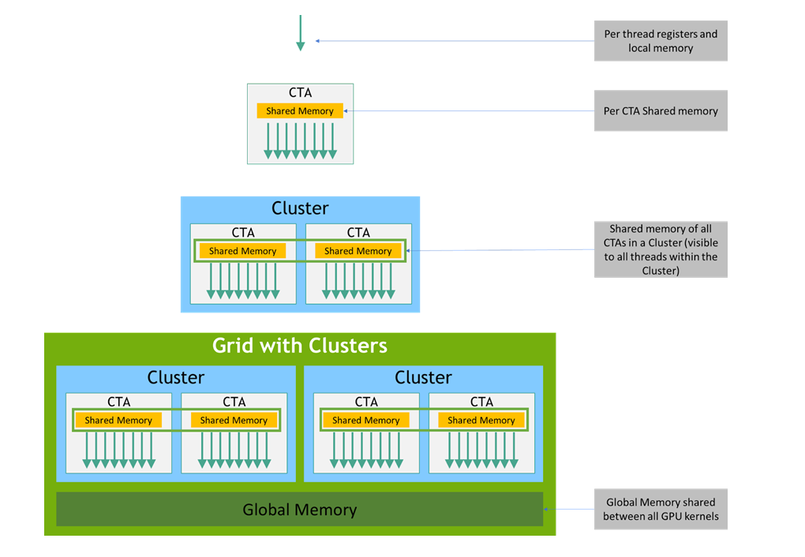

# Memory Semantic Qualifiers
In NVIDIA's PTX (Parallel Thread Execution) ISA, memory-semantic qualifiers dictate how memory operations (loads, stores, and atomics) are ordered and synchronized across different threads.

Starting with PTX ISA version 6.0, NVIDIA adopted a formally defined **Memory Consistency Model** that closely mirrors the C++11 memory model. Because GPUs are highly parallel and execute instructions out-of-order, memory operations can be observed in different sequences by different threads unless explicitly synchronized.

These qualifiers allow developers to strictly control hardware reordering and cache behaviors without relying on heavy, global memory barriers.

### Summary of Memory-Semantic Qualifiers

| Qualifier | Applicable To | Semantics | Typical Use Case |
| --- | --- | --- | --- |
| **`.weak`** | Loads, Stores | No memory ordering guarantees. (Default) | Standard non-synchronized data access. |
| **`.volatile`** | Loads, Stores | Bypasses caches to guarantee memory visibility. | Legacy synchronization (pre-PTX 6.0). |
| **`.relaxed`** | Atomics, Memops | Guarantees atomicity, but no ordering for *other* operations. | Counters, stats where order doesn't matter. |
| **`.release`** | Stores, Atomics | Operations *before* this cannot be reordered after it. | Publishing data to other threads. |
| **`.acquire`** | Loads, Atomics | Operations *after* this cannot be reordered before it. | Safely reading published data. |
| **`.acq_rel`** | Atomics | Combines `.acquire` and `.release`. | Synchronization primitives (e.g., spinlocks). |

---

### Detailed Breakdown

#### 1. `.weak` (The Default)

If you do not specify a qualifier, PTX assumes `.weak`.

* **Behavior:** The compiler and the hardware are completely free to reorder these memory operations for optimal performance. There are no synchronization guarantees relative to other threads.
* **When to use:** For standard computations where data is entirely local to a thread, or when explicit barrier instructions (like `bar.sync`) are handling the synchronization.

#### 2. `.volatile` (The Legacy Approach)

Before the introduction of the modern memory consistency model, developers relied on `.volatile` to implement lock-free data structures.

* **Behavior:** It prevents the compiler from optimizing away the memory access (e.g., storing a value only in a register). At the hardware level, it typically bypasses or invalidates the L1 cache, forcing a direct read/write to the next level of the memory hierarchy.
* **Limitations:** While it forces memory visibility, it does *not* provide formal ordering guarantees for surrounding non-volatile instructions. Modern PTX code should use `.acquire` and `.release` instead.

#### 3. `.relaxed`

* **Behavior:** It guarantees that the specific operation is atomic (often used with `atom` instructions) but provides **no ordering constraints** for any surrounding memory operations.
* **When to use:** When you need to update a shared variable safely, but the program's logic does not depend on the exact order of that update relative to other memory reads/writes. A classic example is a shared atomic counter or a metrics accumulator.

#### 4. `.release` and `.acquire` (The Publish-Subscribe Pattern)

These two qualifiers work together to safely share data between threads without requiring global barriers.

* **`.release` (Stores):** Think of this as "publishing." When a thread executes a store with `.release`, it guarantees that all memory writes made by this thread *prior* to the release store are strictly visible to any thread that observes the release.
* **`.acquire` (Loads):** Think of this as "subscribing." When a thread executes a load with `.acquire`, it guarantees that no subsequent memory reads/writes in the thread will be executed or observed *before* the acquire completes.

**Example Scenario:** Thread A writes a payload of data to memory (using `.weak`), and then sets a `ready_flag` to 1 using a `.release` store. Thread B reads the `ready_flag` using an `.acquire` load. If Thread B sees the flag as 1, it is mathematically guaranteed to see all the payload data Thread A wrote.

This scenario demonstrates the foundational pattern of lock-free parallel programming: **publishing data via acquire-release synchronization**.

To understand why this guarantee works, it helps to examine what happens at the hardware level, how memory operations are reordered, and why both sides of the pair are strictly necessary.

---

**The Problem: Hardware and Compiler Reordering**

Modern GPU architectures aggressively reorder instructions and use deeply pipelined, multi-level memory hierarchies (registers, L1 cache, L2 cache, global memory) to maximize throughput.

Without synchronization, two problems occur:

1. **Store Reordering (Thread A):** The GPU compiler or execution pipeline might execute the store to `ready_flag` *before* the stores to the payload data are flushed to shared/global memory. Thread B could see `ready_flag == 1` while the payload is still sitting in Thread A's local pipeline or L1 cache.
2. **Load Reordering (Thread B):** Thread B's execution pipeline might speculatively read the memory address of the payload *before* it reads `ready_flag`. Even if `ready_flag` later turns out to be `1`, Thread B would be holding stale payload data fetched out-of-order.

---

**How Acquire-Release Solves It**

The `.release` and `.acquire` qualifiers act as directional one-way memory barriers that constrain hardware reordering.

```
Thread A (Producer)                      Thread B (Consumer)

Store Payload (weak)                     Load Flag (acquire) ───┐ [Acquire Barrier]
Store Payload (weak)                                            │ Prevents subsequent loads/stores
         │                                                      │ from moving BEFORE the acquire.
         ▼ [Release Barrier]                                    │
Prevents prior loads/stores ─── Synchronizes ─────────────────►  ▼
from moving AFTER the release.    With                  Read Payload (weak)
         │                                              Read Payload (weak)
         ▼
Store Flag = 1 (release)
```

**1. On the Producer Side (`.release`)**

When Thread A executes `st.global.release.gpu [ready_flag], 1;`:

* **Memory Barrier Effect:** The hardware enforces a "release barrier." No memory read or write that appears *before* the `.release` instruction in program order can be reordered *after* it.
* **Cache Management:** Any dirty data generated by Thread A prior to the release (including the payload) is committed to a point in the memory hierarchy visible to the declared scope (e.g., pushed out of SM-private L1 to the shared L2 cache for `.gpu` scope).

**2. On the Consumer Side (`.acquire`)**

When Thread B executes `ld.global.acquire.gpu %r0, [ready_flag];`:

* **Memory Barrier Effect:** The hardware enforces an "acquire barrier." No memory read or write that appears *after* the `.acquire` instruction in program order can be executed or speculatively loaded *before* the acquire completes.
* **Cache Management:** If the load reads the value written by Thread A's release store (i.e., `%r0 == 1`), Thread B's local cache states are invalidated or updated so that subsequent reads are guaranteed to fetch the freshly committed data from the shared memory hierarchy.

---

**Why It Is "Mathematically Guaranteed"**

In the formal PTX Memory Consistency Model (which inherits from C++11 memory semantics):

1. **Synchronizes-With Relation:** A store-release operation $A$ *synchronizes-with* an load-acquire operation $B$ if $B$ reads the value written by $A$ (or written by any operation in $A$'s release sequence).
2. **Happens-Before Relation:**
* Writing the payload precedes $A$ in Thread A's program order.
* $A$ *synchronizes-with* $B$.
* $B$ precedes reading the payload in Thread B's program order.


3. Transitively, **writing the payload *happens-before* reading the payload**.

Because of this formal chain, the memory model guarantees that once Thread B observes `ready_flag == 1`, all memory effects produced by Thread A prior to its release store are visible to Thread B.

---

**What Happens If You Break the Pair?**

| Thread A | Thread B | Result | Why It Fails |
| --- | --- | --- | --- |
| `.release` | `.acquire` | **Guaranteed Correct** | Complete synchronization chain established. |
| `.weak` | `.acquire` | **Data Race / Stale Read** | Thread A's flag store could reach L2 *before* the payload store finishes. Thread B sees `flag == 1` but reads uninitialized payload. |
| `.release` | `.weak` | **Data Race / Stale Read** | Thread A flushed payload correctly, but Thread B might speculatively load payload from its local cache *before* checking the flag. |


#### 5. `.acq_rel` (Acquire-Release)

* **Behavior:** This is exclusively used for Read-Modify-Write (atomic) operations. It acts as both an `.acquire` for the read portion of the atomic instruction, and a `.release` for the write portion.
* **When to use:** Implementing concurrent data structures, mutexes, and spinlocks where a thread needs to acquire a lock (read) and subsequently release it (write) while ensuring all intermediate memory operations stay contained within that critical section.

---

### The Crucial Role of "Scope"

In modern PTX, memory-semantic qualifiers (except `.weak` and `.volatile`) must be paired with a **Scope Qualifier**.

Because GPU memory is deeply hierarchical, enforcing a global `.acquire` or `.release` across the entire GPU is extremely expensive. By defining a scope, you tell the hardware exactly *how far* the synchronization needs to travel, optimizing performance.



* **`.cta`:** Synchronizes only with threads inside the same Cooperative Thread Array (Thread Block).
* **`.cluster`:** Synchronizes across a specific cluster of CTAs (introduced in newer architectures like Hopper).
* **`.gpu`:** Synchronizes across all threads running on the current GPU.
* **`.sys`:** Synchronizes across the entire system, including multiple GPUs (via NVLink) or the host CPU.

For example, a complete PTX instruction using these semantics looks like this:
`st.global.release.gpu.b32 [ptr], %r1;` (Store to global memory, with release semantics, visible to the whole GPU).

`ld.global.acquire.gpu.b32 %r1, [ptr];` guarantees a read from a globally coherent memory level (L2 or VRAM), ensuring that it strictly observes any `.release.gpu` store executed by another SM.
