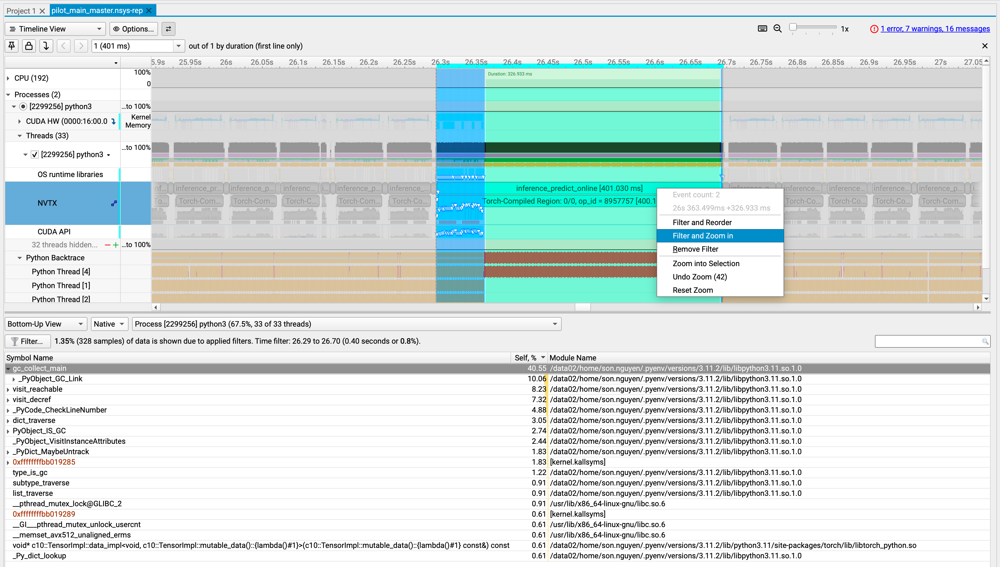
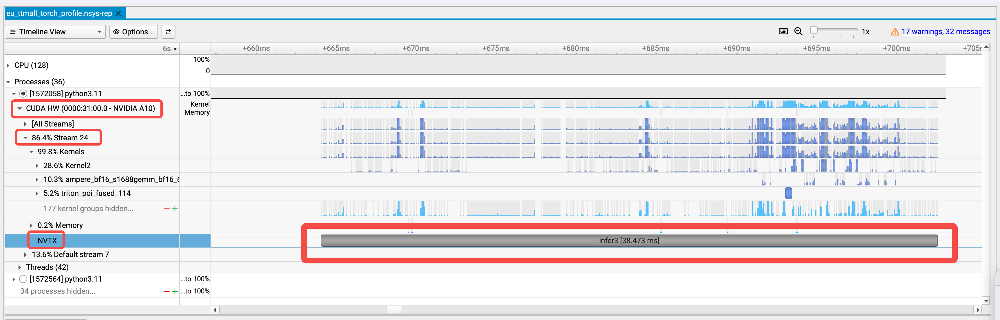
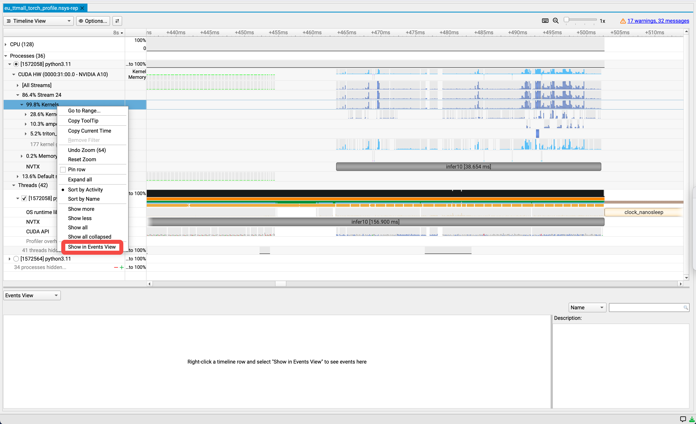

# Profile
## Step 1: Add NVTX ranges
Modify /path/to/app.py:
```Python
with torch.no_grad(), torch.autograd.profiler.emit_nvtx():
    torch.cuda.nvtx.range_push(f"inference")
    outputs = model(inputs)
    torch.cuda.nvtx.range_pop()
```
<br/>

If the app is written in C++, then use the corresponding NVTX C APIs:
```C++
#include <nvtx3/nvToolsExt.h>

nvtxRangePushA("ipc_sync");
std::unique_ptr<IOMessage, std::function<void(IOMessage*)>> response = ipc->ipc_sync(builder.message());
nvtxRangePop();
```

## Step 2: Adjust perf_event_paranoid
Change the paranoid level to 1 to enable CPU kernel sample collection
```Bash
sudo sh -c 'echo 1 >/proc/sys/kernel/perf_event_paranoid'
```

## Step 3: Launch app with `nsys launch`
Please note that both `nsys launch` and `nsys xxx` must use the same env var `TMPDIR`.
```Bash
# Terminal 1
nsys launch --session-new=inference_worker --trace=cuda,nvtx,osrt --python-sampling=true python3 /path/to/app.py
```

```Python
    begin_cmd = [
        "/usr/bin/numactl",
        "--interleave=all",
    ],
    if os.getenv("NSYS_LAUNCH", "0") in ["1", "true"]:
        begin_cmd = [
            "/usr/local/cuda-13.1/bin/nsys",
            "launch",
            "--session-new=inference_worker",
            "--trace=cuda,nvtx,osrt",
            "--python-sampling=true"
        ]
    cmd = begin_cmd + [
        "python3",
        f"{start_script}",
    ]
```

## Step 4: Collect profiling data
Please note that both `nsys launch` and `nsys xxx` must use the same env var `TMPDIR`.
```Bash
# Terminal 2
#===============================
# Double check TMPDIR
#===============================
echo $TMPDIR

/usr/local/cuda-13.1/bin/nsys sessions list
/usr/local/cuda-13.1/bin/nsys status --session=inference_worker

/usr/local/cuda-13.1/bin/nsys start --session=inference_worker --output=./inference_worker_profile --force-overwrite=true --sample=cpu --backtrace=dwarf

/usr/local/cuda-13.1/bin/nsys start --session=inference_worker --output=./inference_worker_profile_2s --force-overwrite=true --sample=cpu --backtrace=dwarf

/usr/local/cuda-13.1/bin/nsys status --session=inference_worker

# Wait for a while
/usr/local/cuda-13.1/bin/nsys stop --session=inference_worker
```
<br/>

# View C++ call stack
Step 1: Left click and drag to select the desired block <br/>
Step 2: Right click and select 'Filter and Zoom in' <br/>
Step 3: Navigate to the bottom pane and select "Bottom-Up View"



# Check kernel duration

<br/>

# Show kernels in Events View window



# Query nsys report using sqlite3
### Step 1: Export the Profile to SQLite
```bash
nsys export --type sqlite worker_profile.nsys-rep
```

### Step 2: Using Built-in `sqlite3` (No external dependencies)

This method uses the standard library to execute the query and iterates through the results to print them row by row.

Check out [../scripts/analyze_nsys_report.py](../scripts/analyze_nsys_report.py)


# Common Issues
## Unable to collect CPU kernel IP/backtrace samples. perf event paranoid level is 2.
**Solution:** Change the paranoid level to 1 to enable CPU kernel sample collection:
```Bash
sudo sh -c 'echo 1 >/proc/sys/kernel/perf_event_paranoid'
```

## Failed to probe the process
```cpp
terminate called after throwing an instance of 'boost::wrapexcept<QuadDCommon::LogicException>'
  what():  LogicException
Failed to probe the process (sync). Timeout: 2 sec
```

**Quick Check**

Double-check the environment variable `LD_PRELOAD`, ensure that it is empty before starting `nsys`.

If it includes `libjemalloc.so`, then `nsys` will throw the exception.


**Debug Steps:**

**Step 1: Configure `nsys` log**

```bash
# Find the template (adjust path if your install is different)
find /usr/local/cuda-13.1 -name nvlog.config.template

# Copy and edit it
cp /usr/local/cuda-13.1/.../nvlog.config.template /tmp/nvlog.config
# Inside the file change the log target to something like:
# $ /tmp/nsys-agent.log

# export NVLOG_CONFIG_FILE
export NVLOG_CONFIG_FILE=/tmp/nvlog.config
```


**Step 2: Check `nsys` log**

Check /tmp/nsys-agent.log

