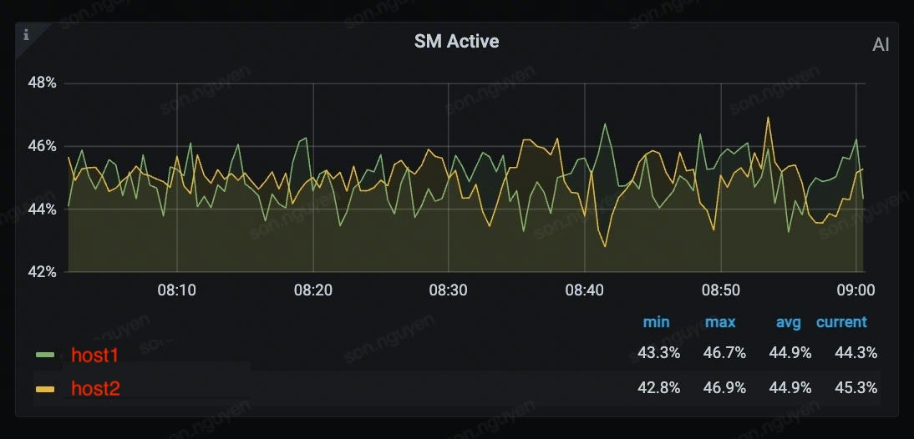

# SM Active

## How SM Active is measured


### DCGM_FI_PROF_SM_ACTIVE Metric
**`DCGM_FI_PROF_SM_ACTIVE`** is the Data Center GPU Manager (DCGM) equivalent of the Nsight Compute metric we just discussed.

Here is the exact definition from NVIDIA's documentation:

> *The fraction of time at least one warp was active on a multiprocessor, averaged over all multiprocessors.*

The value is returned as a ratio between `0.0` and `1.0` (which translates to 0% to 100% of the time). Just like the other metrics, "**active**" simply means a warp is resident on the SM; it doesn't mean it is actively computing (it could be stalled waiting on memory).

#### How to collect DCGM_FI_PROF_SM_ACTIVE
Here is exactly how the data flows from the silicon to your C++ application:

##### The Data Pipeline

1. **The GPU Silicon (The Source):**
Inside the GPU, each Streaming Multiprocessor (SM) has physical hardware performance counters. These counters are baked into the silicon and increment on specific clock cycles—for example, when a warp is active.

2. **The NVIDIA Driver / Profiling API:**
The NVIDIA driver has special hooks to read these hardware registers. Because reading performance counters can introduce slight overhead, these hooks are usually turned off by default.

3. **`nv-hostengine` (The Manager):**
This is the DCGM background daemon. When your C++ code calls `dcgmWatchFields`, `nv-hostengine` reaches down to the NVIDIA driver and says: *"A user wants to know about `DCGM_FI_PROF_SM_ACTIVE`. Turn on the hardware profiling counters for the SMs and send me the data every 1 second."*

`nv-hostengine` then continuously collects these raw hardware samples, averages them out, and stores the resulting `0.0` to `1.0` ratio in its own memory cache.

`nv-hostengine` belongs to `datacenter-gpu-manager-4-cuda13` package and the corresponding systemd unit file is `nvidia-dcgm.service`:
```bash
# List installed debian packages
dpkg --list | grep 'datacenter-gpu-manager'

# Check if nv-hostengine is running
ps -efw | grep 'nv-hostengine'
systemctl status nvidia-dcgm.service
```

4. **Your C++ Code (The Client):**
When you call `dcgmGetLatestValues_v2`, your program queries `nv-hostengine`'s cache over a local socket connection (which is why we connected to `127.0.0.1` in the code) and prints the result.

Install headers:
```bash
# 1. Download the NVIDIA CUDA keyring for Debian 12
wget https://developer.download.nvidia.com/compute/cuda/repos/debian12/x86_64/cuda-keyring_1.1-1_all.deb

# 2. Install the keyring (this adds the repository and signing keys to apt)
sudo dpkg -i cuda-keyring_1.1-1_all.deb

# 3. Update your apt cache so it sees the newly added NVIDIA packages
sudo apt-get update

# 4. Install the DCGM development package
sudo apt-get install datacenter-gpu-manager-4-dev
```

##### Why this distinction matters

Understanding this pipeline explains why the C++ code requires you to "watch" the field and then `sleep()` for a few seconds.

If `nv-hostengine` was generating the data itself, you could just ask for it instantly. But because it has to configure the GPU's hardware counters, wait for the GPU to run cycles, pull the data back across the PCIe bus, and aggregate it, you have to give the system time to actually record the hardware events.

##### A Note on Overhead

Because `nv-hostengine` relies on the GPU's hardware profiling counters to get `DCGM_FI_PROF_SM_ACTIVE`, leaving this watch active *permanently* at a very high frequency (e.g., polling every millisecond) can introduce a tiny amount of performance overhead to the GPU workloads. This is why DCGM allows you to configure the update interval in the `dcgmWatchFields` function. An interval of 1 second (1,000,000 microseconds) is standard for monitoring and introduces virtually zero noticeable overhead.


### NVML_GPM_METRIC_SM_OCCUPANCY Metric
Percentage of warps that were active vs theoretical maximum concurrent warps that a single Streaming Multiprocessor (SM) can physically support at one time, assuming no other resource bottlenecks.

Range: 0.0 - 100.0

### CUPTI (CUDA Profiling Tools Interface) Metric
NVIDIA GPUs are composed of multiple **Streaming Multiprocessors (SMs)**. Each SM is responsible for executing threads in groups of 32, known as warps.

**SM Active** (often labeled as `sm__active_cycles.avg.pct_of_peak_sustained_elapsed` in NVIDIA's profiling tools) represents the percentage of time that at least one warp is active—meaning it is resident on the SM and either executing, waiting on memory, or stalling.

This metric is typically aggregated across the entire GPU. You can define the relationship mathematically as:

$$\text{Overall SM Active} = \frac{\sum_{i=1}^{N_{\text{SM}}} \text{Active Cycles for SM}_i}{N_{\text{SM}} \times \text{Elapsed Cycles}} \times 100$$

Where $N_{\text{SM}}$ is the total number of Streaming Multiprocessors on the GPU.

If your GPU has 100 SMs and only 45 of them have warps assigned to them while the rest sit completely idle, your overall SM Active will report as 45%, even if those 45 SMs are working as hard as possible.

**`DCGM_FI_PROF_SM_ACTIVE`** is the Data Center GPU Manager (DCGM) equivalent of the Nsight Compute metric we just discussed.

If we go back to the "Bus Analogy," `DCGM_FI_PROF_SM_ACTIVE` measures **how much of the time the bus was out on the road** (regardless of whether it was carrying 1 passenger or 64 passengers).

Here is the exact definition from NVIDIA's documentation:

> *The fraction of time at least one warp was active on a multiprocessor, averaged over all multiprocessors.*

The value is returned as a ratio between `0.0` and `1.0` (which translates to 0% to 100% of the time). Just like the other metrics, "active" simply means a warp is resident on the SM; it doesn't mean it is actively computing (it could be stalled waiting on memory).

### How `DCGM_FI_PROF_SM_ACTIVE` compares to `NVML_GPM_METRIC_SM_OCCUPANCY`

These two metrics are designed to be read together to give you a 2D view of your GPU's efficiency:

* **`DCGM_FI_PROF_SM_ACTIVE` (Time):** Measures if the SMs are being used *at all*. If this is 0.2 (20%), it means your SMs are sitting completely idle 80% of the time.
* **`DCGM_FI_PROF_SM_OCCUPANCY` (Capacity):** Measures how *full* the SMs are when they are actually working.

If `SM_ACTIVE` is high but `SM_OCCUPANCY` is low, your GPU is constantly working but doing very little work at a time (often due to register/shared memory limits per thread).

### How `DCGM_FI_PROF_SM_ACTIVE` compares to `sm__active_cycles.avg.pct_of_peak_sustained_elapsed`

Conceptually, **they measure the exact same hardware behavior.** Both calculate the percentage of time that an SM has at least one active warp.

The difference between them is entirely about **tooling, scope, and granularity:**

| Feature | `DCGM_FI_PROF_SM_ACTIVE` | `sm__active_cycles.avg.pct_of_peak_sustained_elapsed` |
| --- | --- | --- |
| **Tool ecosystem** | DCGM (Data Center GPU Manager) / Prometheus / Grafana | CUPTI / Nsight Compute |
| **Target Audience** | System Administrators / MLOps Engineers | CUDA / Kernel Developers |
| **Scope of Measurement** | **System-wide (Macro).** It measures the whole GPU over a fixed sampling interval (e.g., 10 seconds). It includes idle time between kernels and overlapping processes. | **Kernel-specific (Micro).** It measures exact clock cycles tightly bounded by the start and end of a *single specific kernel launch*. |
| **Use Case** | Fleet monitoring, checking if a Kubernetes pod is actually utilizing the GPU it requested, triggering alerts if utilization drops. | Low-level algorithm optimization, finding out exactly which kernel in a pipeline is starving the GPU. |

In short: If you want to know how efficiently your matrix multiplication kernel runs down to the nanosecond, use the Nsight Compute metric. If you want to monitor whether your production AI inference server is being starved of requests over the last 24 hours, use `DCGM_FI_PROF_SM_ACTIVE`.
