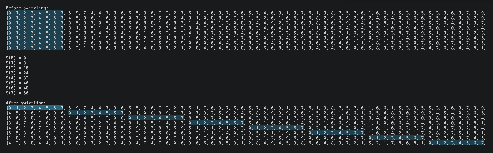

# XOR Swizzling
## Fundamental Formula
Given a matrix $A$ with shape = (ROWS, COLS), and a shift function $S(i) = \text{VEC} * (i \bmod K)$,  
where,
- $i$ is row index
- $\text{VEC}$ is the number of consecutive elements (in the same row) to be shifted. The common value is $8$.
- $K = \text{COLS} // \text{VEC}$. The value of $K$ determines the number of rows after which the swizzling pattern repeats.

$\text{swizzle}(A)$ operation is defined as follows: 
For every $A(i, j)$, shift it to the position of $A(i, j \oplus S(i))$ where, $\oplus$ is the binary XOR operator.

### Example
Select
- $\text{VEC} = 8$
- $K = 8$

$\Rightarrow S(i) = 8 * (i \bmod 8)$

For i = 0: 
- all elements stay at the same locations.

For i = 1, ..., ROW - 1:
- 8 groups, each consisting of 8 consecutive elements, are permuted.

[xor_swizzling.py](./xor_swizzling.py)

## TMA Swizzling Mode
NVIDIA designs GPU hardware with a fixed $\text{VEC}$ size of 16 bytes chunk.

For 128 bytes swizzling mode `CU_TENSOR_MAP_SWIZZLE_128B`, the number of groups to be permuted is: 128/16 = 8.

The swizzling mode 128B dictates the number of groups to be permuted.
