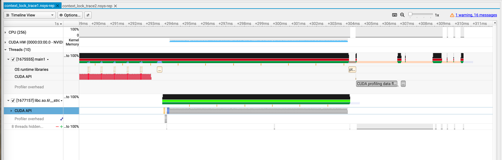
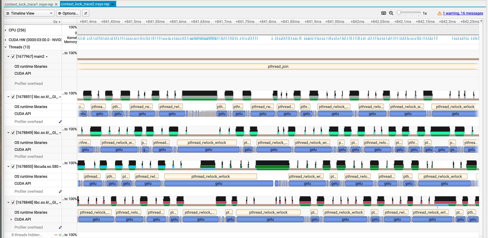

# CUDA Context Lock
## Case 1: Launch gelu kernels serially
Use 1 thread to launch gelu kernels serially. There is no lock:

## Case 2: Launch gelu kernels concurrently
Use 4 threads to launch gelu kernels concurrently. There are many write locks:

OS Runtime Libraries Track: Above CUDA API calls, there are continuous, elongated blocks labeled `pthread_rwlock_wrlock`. This is the POSIX standard for acquiring a write lock on a read-write lock.

Because 4 C++ threads are simultaneously bombarding the same context with gelu launches, they are physically unable to execute concurrently on the CPU. The operating system grants the lock to one thread, while the other three are trapped inside `pthread_rwlock_wrlock` waiting for their turn. This inflates the API call from a few microseconds to a massive stall, leaving the GPU waiting for work.
