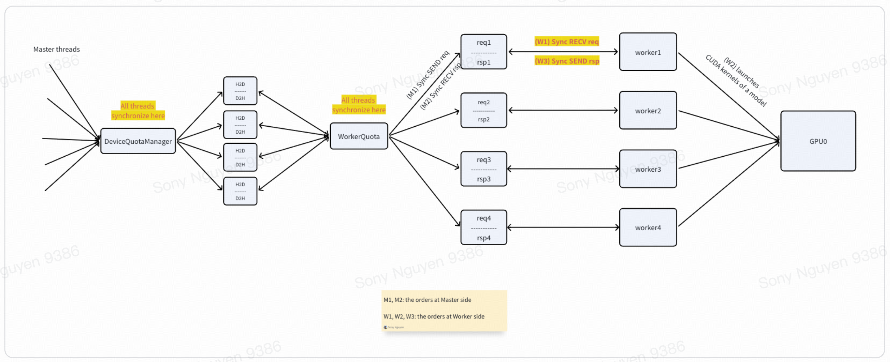
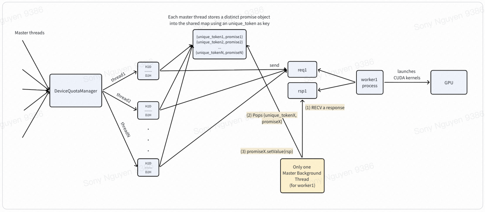

# Inference Server
Architecture: Masters <-> IPC Queues <-> Workers

## Synchronous IPC Architecture

**Bottleneck**:  
While a master thread is sending a request to or receiving a response from worker1, worker1 is marked as busy, so no other master threads can communicate with it.
==> The bottleneck is the tight coupling between IPC SEND and IPC RECV. While IPC SEND is quick, IPC RECV is slow because it needs to wait until the worker finishes executing the model on GPU and then IPC SEND the response back to the rsp queue.

## Asynchronous IPC Architecture
The bottleneck can be eliminated by decoupling IPC SEND and IPC RECV, making them asynchronous. The pipeline is as follows:

1. The master process creates dedicated **Master Background Threads** which are responsible for RECV responses from workers. One Master Background Thread for one worker.

2. Modify the DeviceQuotaManager and related classes to support worker concurrency. This allows multiple master threads to concurrently IPC SEND their requests to the same worker.

3. Concurrently, each master thread (in the same cluster) creates a folly::Promise object and gets a future object from it. Then, it moves the folly::Promise object into a shared map using an unique_token as key.

4. Next, master threads concurrently send their requests to the same IPC message queue designated for the pair {device_id=0, worker_id=0}. Then, each master thread calls future.wait() to sleep until being awakened by the dedicated Master Background Thread for the pair {device_id=0, worker_id=0}.

5. The dedicated Master Background Thread receives a response from the designated IPC message queue for the pair {device_id=0, worker_id=0}. It extracts the unique_token from the response and then pops the corresponding folly::Promise object from the shared map. Then, it sets the response into the folly::Promise object to wake up the corresponding master thread.

6. After the corresponding master thread wakes up, it gets the response from its future object and then sends the response back to its client.
