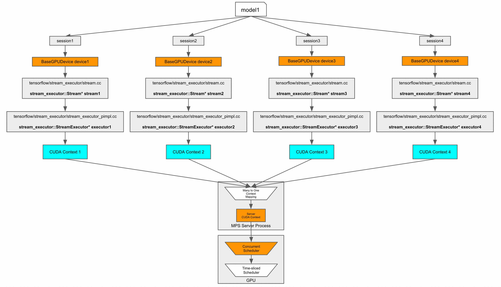

# Multi-CUDA Context
## The Problem: The CUDA Context Lock
An inference server process initializes a single CUDA context.

It can run multiple TF sessions at the same time, which launch multiple CUDA kernel at the same time.

### The CUDA Context Lock

In the CUDA driver model, a `CUcontext` is essentially the GPU equivalent of a CPU process. It acts as a container that encapsulates all the state, memory allocations, and resources (such as Streams, Events, and library handles like `cublasHandle_t` or `cudnnHandle_t`) for a specific device.

To ensure thread safety when modifying state or pushing commands to the driver, NVIDIA implements a **context-wide lock**. Whenever a host (CPU) thread executes a kernel launch, it must temporarily acquire this lock.

Demo: [../../CUDA/src/cuda_context_lock/](../../CUDA/src/cuda_context_lock/)

### The Host-Side Serialization Bottleneck

Because the lock is held on a per-context basis, **CPU-side kernel launches are strictly serialized within the same context.**

This means that even if you design a highly parallel architecture where multiple CPU threads are pushing independent workloads to multiple independent CUDA streams, the actual *launches* will bottleneck at the CPU. The CPU threads will form a queue, waiting to acquire the single context lock one by one. In high-throughput or highly concurrent scenarios (such as AI inference servers or large-scale data processing), this microsecond-level serialization severely starves the GPU, leaving it idle while it waits for the CPU to hand it work.

## The Multi-Context Solution

The refactoring described in the claim is a known architectural pattern to circumvent this host-side bottleneck:

* **Eliminating Contention:** By creating **multiple CUDA contexts on a single GPU**, each context receives its own independent lock. Multiple CPU threads can now launch kernels simultaneously without blocking each other.
* **Resource Duplication:** Because CUDA resources are strictly bound to the context in which they were created, this refactoring inherently requires initializing a completely separate set of Streams, Events, and cuBLAS/cuDNN handles for every single context you create.

> **The Engineering Trade-off:** While this completely solves the CPU-side launch contention, having multiple contexts on a single GPU traditionally forces the hardware to *time-slice* execution between the contexts. This means kernels from Context A and Context B cannot physically run on the GPU silicon at the exact same time. To get the best of both worlds—parallel host-side launches *and* parallel GPU-side execution—systems using this architecture typically run alongside **NVIDIA's Multi-Process Service (MPS)**, which effectively fuses multiple contexts at the hardware level.

## TensorFlow Modifications
### 1. Device and Context
By default, TF create a single GPUDeviceContext object for each GPU card.

**Change `TfDeviceId` to `DeviceContextId`:**  
The original `tf_device_id` (int32) is split into two parts: 
- the upper 16 bits and 
- the lower 16 bits 
They represent tf_device_id and context_id, respectively, and Pack/Unpack operations are performed on the int32 when necessary.

`StreamExecutor` is changed from a per-device instance to a per-<device, context> instance.

### 2. Share Model Weights
If we create 4 TF sessions to load a single model, then the model weights will be copied to GPU memory 4 times. This leads to OOM very quickly.

To address this issue, we have to modify the `ResourceMgr` to support sharing underlying GPU memory buffers for `VariableV2` and `Const` ops across TF sessions for the same model.

