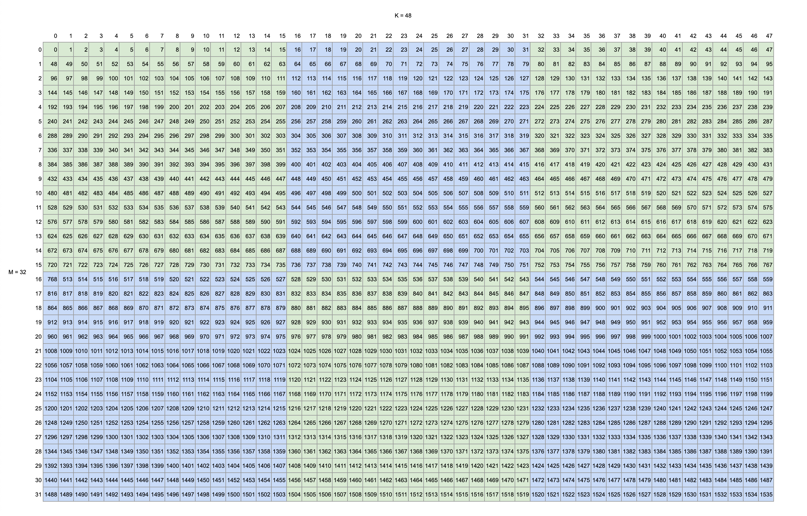
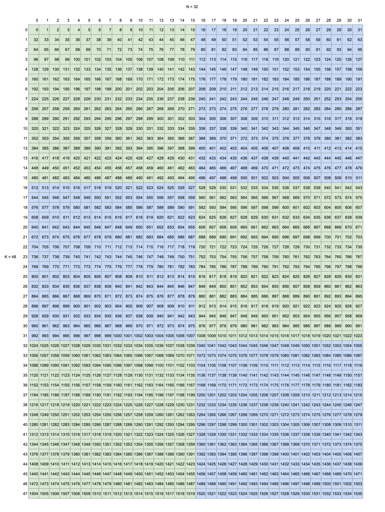
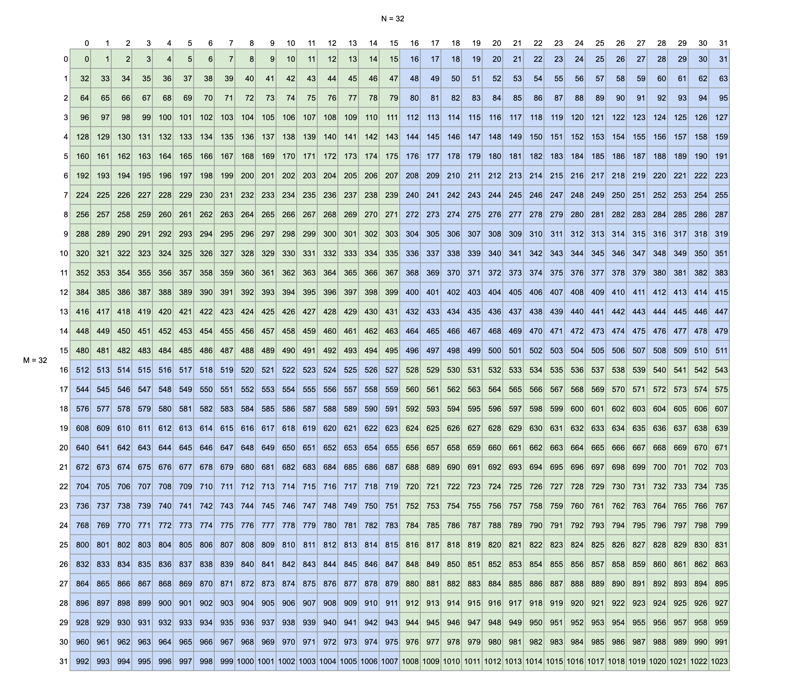

# GEMM
Compute a typical GEMM:
```python
C = A @ B
```

For example, 
- `A` with shape `(M=32, K=48)`
- `B` with shape `(K=48, N=32)`

```python
BLOCK_M = 16
BLOCK_N = 16
BLOCK_K = 16
```

<br/>

The following are tiles and element offsets in each matrix. <br/>
Each tile is colored and each number represents an element offset.

**A's tiles and element offsets:** <br/>


<br/>

**B's tiles and element offsets:**



<br/>

**C's tiles and element offsets:**



<br/>

The Triton kernel must be launched with the following grid size:
```python
grid = (grid_m * grid_n, 1, 1)
```
Where,
```python
grid_m  = (M + BLOCK_M - 1) // BLOCK_M
        = (32 + 15) // 16
        = 2

grid_m  = (N + BLOCK_N - 1) // BLOCK_N
        = (32 + 15) // 16
        = 2
```

There will be `grid_m * grid_n` programs (CTAs), each of which is responsible for 1 output `C[pid_m, pid_n]` tile. <br/> 
Where, 
```python
# pid range is [0, 1, 2, ..., (grid_m * grid_n - 1)]
pid = tl.program_id(0)

# Since pid = pid_m * grid_n + pid_n, then
# according to the Euclidean division formula a = bq + r
pid_m = pid // grid_n
pid_n = pid % grid_n

         pid_n                  
        ┌─────┬─────┬
  pid_m │ 0,0 │ 0,1 │
        ├─────┼─────┼
        │ 1,0 │ 1,1 │
        ├─────┼─────┼
```

The number of K tiles:
```python
k_tiles = (K + BLOCK_K - 1) // BLOCK_K
        = (48 + 15) // 16
        = 3
```

## Load A tiles

Code snippet for loading A's tiles:
```python
    rm = pid_m * BLOCK_M + tl.arange(0, BLOCK_M)

    # NOTE: You must ensure that M is multiple of BLOCK_M
    offs_a_m = tl.max_contiguous(rm, BLOCK_M)
    idx_m = offs_a_m[:, None]

    # Omit for brevity

    # Loop through k_tiles
    k_tiles = tl.cdiv(K, BLOCK_K)
    offs_k = tl.arange(0, BLOCK_K)
    for k_idx in range(0, k_tiles):
        # Load A tile
        idx_k = offs_k[None, :] + (k_idx * BLOCK_K) # shape = (1, BLOCK_K)
        a = tl.load(A + (idx_k + K * idx_m))
```
