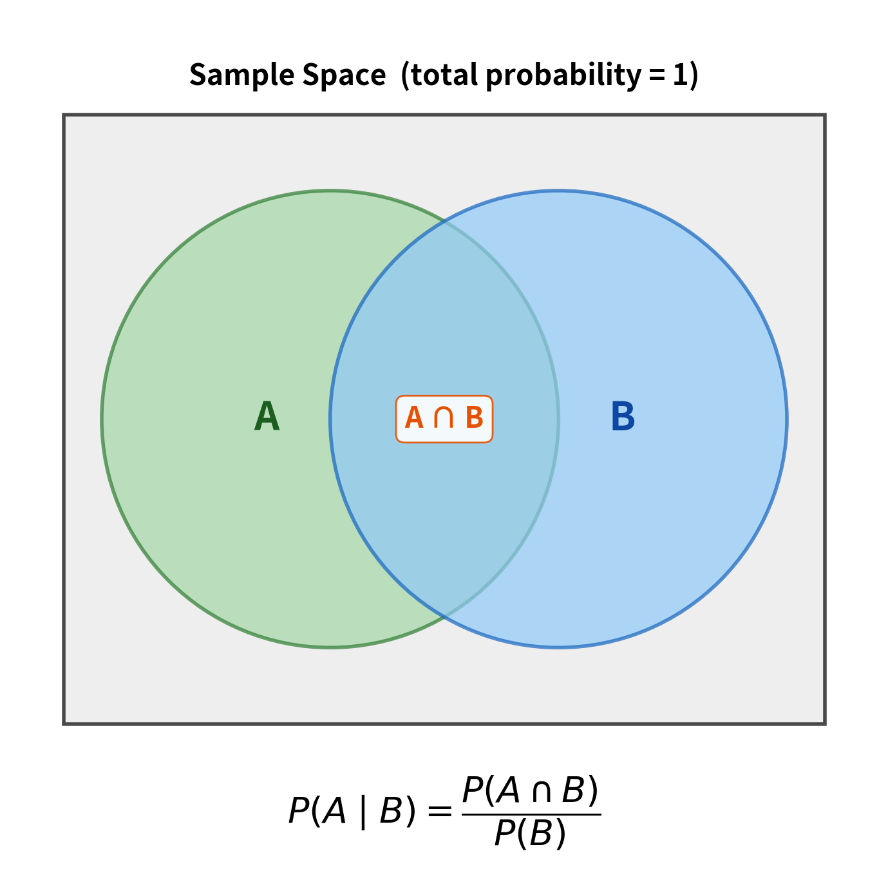

# Conditional Probability

### 1. The formal formula
$`P(A \mid B) = \frac{P(A \text{ and } B)}{P(B)}`$
(As long as $`P(B) > 0`$.)
- $A$ = the event we care about
- $B$ = the condition (the information we already know)
- $A$ and $B$ = both happen together (the intersection)

**Conditional probability** is the probability that $A$ happens given that $B$ has already happened (or is known to be true).

### 2. How is the formula derived?

Imagine we repeat an experiment 10,000 times.

- Event B happens in roughly $10{,}000 \times P(B)$ of those trials.
- Both A and B happen in roughly $10{,}000 \times P(A \text{ and } B)$ of those trials. Note that $A$ and $B$ are properties of one trial.

Now ask: **Among the times B happened**, how often did A also happen?

We start with the fact that:

$`\text{Number of times } B \text{ happened} = \text{Number of times (}A \text{ and } B \text{) happened} + \text{Number of times (}B \text{ and not } A\text{) happened}`$

Dividing both sides by "Number of times $B$ happened", we get:

$`1 = \frac{\text{Number of times (}A \text{ and } B \text{) happened}}{\text{Number of times } B \text{ happened}} + \frac{\text{Number of times (}B \text{ and not } A\text{) happened}}{\text{Number of times } B \text{ happened}}`$

$\Leftrightarrow$

$`1 = \frac{P(A \text{ and } B)}{P(B)} + \frac{P(B \text{ and not } A)}{P(B)}`$

Denote 

$`P(A \mid B) = \frac{P(A \text{ and } B)}{P(B)}`$

$`P(\text{not } A \mid B) = \frac{P(B \text{ and not } A)}{P(B)}`$

Finally, we get:

$`1 = P(A \mid B) + P(\text{not } A \mid B)`$

**Meaning:**
- Ordinary probability $P(A)$ = "How often does A happen in the whole world?"
- Conditional probability $P(A \mid B)$ = "How often does A happen inside the smaller world where B is true?"

### 3. Concrete examples
#### 3.1. Vowels in a poem
Given a poem, counting vowels (V), we get: 
- P(V) = 0.43
- P(VV) = 0.06

0.06 is the probability of a VV pair when we look at the entire poem.
But once we are already standing on a vowel, the relevant "universe" is only the vowel positions (which make up 43% of the letters).

So we ask: of that 43%, what fraction is followed by another vowel?

That is $  0.06 / 0.43 \approx 0.14  $.

If we forgot to divide, we would be saying "14% of the whole poem is a VV pair starting from a vowel", which is wrong. We only care about the percentage among the vowels.

#### 3.2. Frequency
Imagine we run a experiment 10,000 times.

- $B$ happens 4,000 times  
- Both $A$ and $B$ happen 1,200 times

The big-world probabilities are:

$`P(B) \approx \frac{4000}{10000}, \quad P(A \cap B) \approx \frac{1200}{10000}`$

But if we only look at the 4,000 trials where $B$ occurred, then A happened in 1,200 of them.  
So inside the smaller world the frequency is:

$`\frac{1200}{4000} = \frac{1200/10000}{4000/10000}`$

Again, the big-world total cancels, and we are left with the correct small-world frequency.

### 4. Mental model

Think of probability as "area".

- The whole sample space has total area 1.
- Region $B$ has area $P(B)$.
- The overlapping region $A \cap B$ has area $P(A \cap B)$.

When we condition on $B$, we throw away everything outside $B$ and **renormalize** so that the remaining area equals 1.  
The new area of the $A$-part inside this renormalized world is exactly $\frac{P(A \cap B)}{P(B)}$.

The original big-world measurements already told us how much area each piece had relative to the whole. Taking their ratio tells us how much area the $A$-piece has relative to the $B$-piece.

