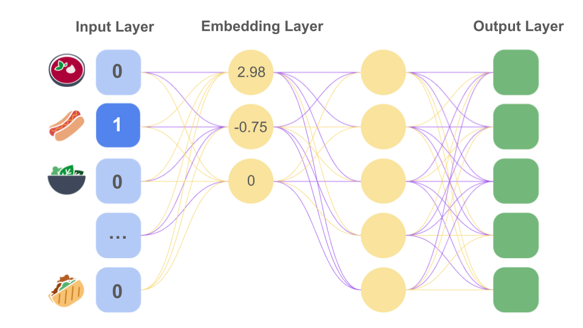

# Embedding Layer
The output will be a (3, 6, 3) matrix, which correlates to `(batch_size, seq_length, d_model)`. Essentially, each indexed token is replaced by its corresponding 3-dimensional embedding vector.

Before moving to the next sections, it is extremely important to understand the shape of this data, `(batch_size, seq_length, d_model)`:

- `batch_size` correlates to the number of sequences provided at a time, which is normally 16, 32, or 64.
- `seq_length` correlates to the number of words or tokens in each sequence after tokenization.
- `d_model` correlates to the size of the model after each token has been embedded.

## From Google
https://developers.google.com/machine-learning/crash-course/embeddings/obtaining-embeddings
Training an embedding as part of a neural network
You can create an embedding while training a neural network for your target task. This approach gets you an embedding well customized for your particular system, but may take longer than training the embedding separately.

In general, you can create a hidden layer of size d in your neural network that is designated as the embedding layer, where d represents both the number of nodes in the hidden layer and the number of dimensions in the embedding space. This embedding layer can be combined with any other features and hidden layers. As in any deep neural network, the parameters will be optimized during training to minimize loss on the nodes in the network's output layer.

Returning to our food recommendation example, our goal is to predict new meals a user will like based on their current favorite meals. First, we can compile additional data on our users' top five favorite foods. Then, we can model this task as a supervised learning problem. We set four of these top five foods to be feature data, and then randomly set aside the fifth food as the positive label that our model aims to predict, optimizing the model's predictions using a softmax loss.

During training, the neural network model will learn the optimal weights for the nodes in the first hidden layer, which serves as the embedding layer. For example, if the model contains three nodes in the first hidden layer, it might determine that the three most relevant dimensions of food items are sandwichness, dessertness, and liquidness. Figure 12 shows the one-hot encoded input value for "hot dog" transformed into a three-dimensional vector.

<br/>
Figure 12. A one-hot encoding of hot dog provided as input to a deep neural network. An embedding layer translates the one-hot encoding into the three-dimensional embedding vector [2.98, -0.75, 0].

In the course of training, the weights of the embedding layer will be optimized so that the embedding vectors for similar examples are closer to each other. As previously mentioned, the dimensions that an actual model chooses for its embeddings are unlikely to be as intuitive or understandable as in this example.

## Steps to Create an Embedding Layer:
#### 1. Initialize the Embedding Matrix
- The embedding matrix is a `num_categories × embedding_dim`, where:
  - `num_categories` is the total number of unique categories.
  - `embedding_dim` is the dimensionality of each embedding vector.

- Initialize this matrix randomly (e.g., using uniform or normal distributions).

#### 2. Lookup Operation
Given an input index (or batch of indices), fetch the corresponding row(s) from the embedding matrix.

#### 2. Backpropagation Support
The embedding matrix must be a learnable parameter updated during training through backpropagation.

### Implementation from Scratch:
Python and NumPy Implementation
```Python
import numpy as np

class EmbeddingLayer:
    def __init__(self, num_categories, embedding_dim):
        """
        Initialize the embedding layer.
        Args:
            num_categories (int): Total number of unique categories.
            embedding_dim (int): Dimension of the embedding vector.
        """
        # Randomly initialize the embedding matrix
        self.embedding_matrix = np.random.uniform(-0.01, 0.01, (num_categories, embedding_dim))

    def forward(self, input_indices):
        """
        Perform the lookup operation to fetch embeddings.
        Args:
            input_indices (array-like): Array of indices to lookup.
        Returns:
            np.ndarray: Corresponding embedding vectors.
        """
        return self.embedding_matrix[input_indices]

    def update_embedding(self, index, gradient, learning_rate=0.01):
        """
        Update the embedding for a specific index using gradient descent.
        Args:
            index (int): Index of the embedding to update.
            gradient (np.ndarray): Gradient for the embedding.
            learning_rate (float): Step size for gradient descent.
        """
        self.embedding_matrix[index] -= learning_rate * gradient

# Example Usage
num_categories = 10
embedding_dim = 4

# Initialize the embedding layer
embedding_layer = EmbeddingLayer(num_categories, embedding_dim)

# Input indices
input_indices = [1, 3, 7]

# Forward pass (lookup embeddings)
embeddings = embedding_layer.forward(input_indices)
print("Embeddings:\n", embeddings)
```

### Explanation:
#### 1. Embedding Matrix Initialization:
Random initialization is commonly used to start learning from scratch. Pre-trained embeddings (like Word2Vec or GloVe) can also be loaded here for transfer learning.

#### 2. Lookup Operation:
Directly fetch rows corresponding to input indices.
For batch processing, multiple rows are fetched simultaneously.

#### 3. Gradient Updates:
Gradients are computed during backpropagation and used to update the embedding matrix.

#### 4. Efficient Implementation:
Frameworks like PyTorch and TensorFlow optimize lookup operations, making them computationally efficient and easy to integrate.

By implementing an embedding layer from scratch, you gain insight into its workings and can customize it for specific needs.
