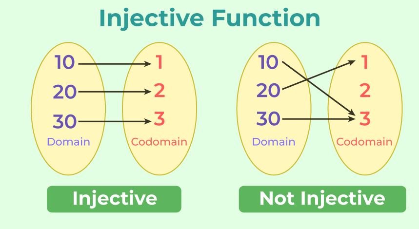

# Injective Function

An injective function (or one-to-one function) is a function that maps distinct elements from its domain to distinct elements in its codomain, ensuring that no two unique inputs produce the same output. If $f(x_1) = f(x_2)$, then it must be that $x_1 = x_2$. They are often verified using the horizontal line test.