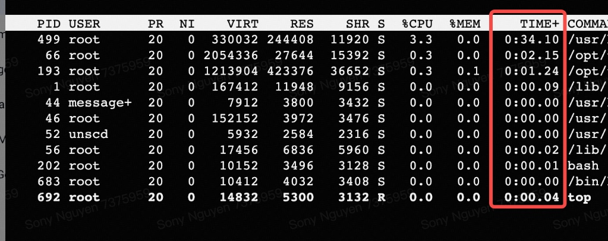

# top command and TIME+ column

### The `TIME+` Column Explained

In the Linux `top` command, the `TIME+` column represents the **total accumulated CPU time** that a process has used since it started.

It is important to note that this is *not* wall-clock time (how long the application has been open or running in the background). Instead, it measures the actual amount of time the CPU spent actively processing instructions for that specific task. If a process is mostly idle, its `TIME+` will increase very slowly, even if it has been running for days.

---

### Units and Format

The standard `TIME` column in `top` displays time in minutes and seconds (`MM:SS`). The `+` in `TIME+` simply indicates a higher level of precision, displaying fractions of a second.

The exact format and unit breakdown is **Minutes:Seconds.Hundredths of a second**.

* **Minutes:** The number before the colon (`:`).
* **Seconds:** The number between the colon and the period (`.`).
* **Hundredths of a second:** The two digits after the period.

**Example from your image:**
Looking at the first entry in the screenshot (PID 499):

* The `TIME+` value is **0:34.10**.
* This translates to **0 minutes, 34 seconds, and 10 hundredths of a second** of active CPU time used by that process since it was launched.