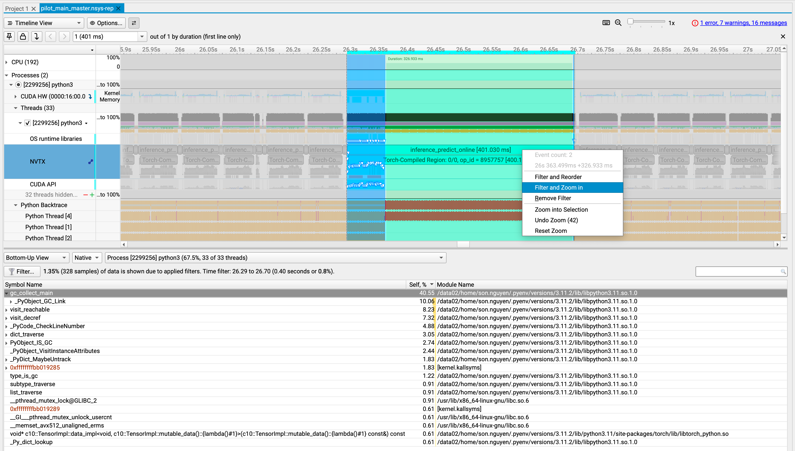
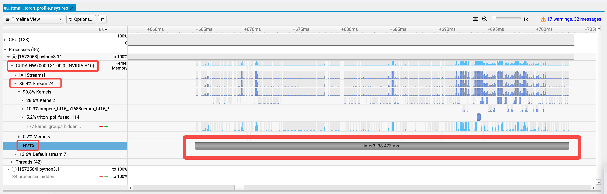
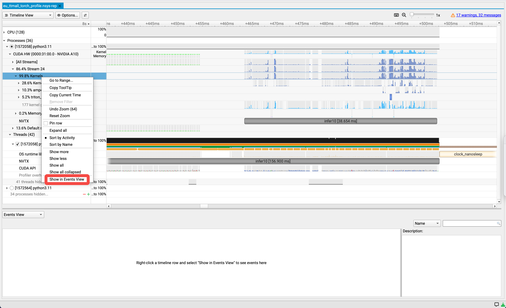

# Profile
## Step 1: Add NVTX ranges
Modify /path/to/app.py:
```Python
with torch.no_grad(), torch.autograd.profiler.emit_nvtx():
    torch.cuda.nvtx.range_push(f"inference")
    outputs = model(inputs)
    torch.cuda.nvtx.range_pop()
```
<br/>

If the app is written in C++, then use the corresponding NVTX C APIs:
```C++
#include <nvtx3/nvToolsExt.h>

nvtxRangePushA("ipc_sync");
std::unique_ptr<IOMessage, std::function<void(IOMessage*)>> response = ipc->ipc_sync(builder.message());
nvtxRangePop();
```

## Step 2: Adjust perf_event_paranoid
Change the paranoid level to 1 to enable CPU kernel sample collection
```Bash
sudo sh -c 'echo 1 >/proc/sys/kernel/perf_event_paranoid'
```

## Step 3: Launch app with `nsys launch`
Please note that both `nsys launch` and `nsys xxx` must use the same env var `TMPDIR`.
```Bash
# Terminal 1
nsys launch --session-new=master --trace=cuda,nvtx,osrt --python-sampling=true python3 /path/to/app.py
```

```Python
    begin_cmd = [
        "/usr/bin/numactl",
        "--interleave=all",
    ],
    if os.getenv("NSYS_LAUNCH", "0") in ["1", "true"]:
        begin_cmd = [
            "/usr/local/cuda-13.1/bin/nsys",
            "launch",
            "--session-new=master",
            "--trace=cuda,nvtx,osrt",
            "--python-sampling=true"
        ]
    cmd = begin_cmd + [
        "python3",
        f"{start_script}",
    ]
```

## Step 4: Collect profiling data
```Bash
# Terminal 2
/usr/local/cuda-13.1/bin/nsys sessions list
/usr/local/cuda-13.1/bin/nsys status --session=master

/usr/local/cuda-13.1/bin/nsys start --session=master --output=./pilot_main --force-overwrite=true --sample=cpu --backtrace=dwarf
/usr/local/cuda-13.1/bin/nsys status --session=master

# Wait for a while
/usr/local/cuda-13.1/bin/nsys stop --session=master
```
<br/>

# View C++ call stack
Step 1: Left click and drag to select the desired block <br/>
Step 2: Right click and select 'Filter and Zoom in' <br/>
Step 3: Navigate to the bottom pane and select "Bottom-Up View"



# Check kernel duration

<br/>

# Show kernels in Events View window



# Common Issues
## Unable to collect CPU kernel IP/backtrace samples. perf event paranoid level is 2.
**Solution:** Change the paranoid level to 1 to enable CPU kernel sample collection:
```Bash
sudo sh -c 'echo 1 >/proc/sys/kernel/perf_event_paranoid'
```
