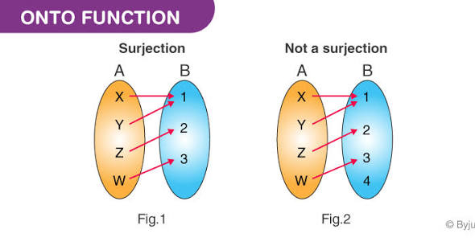

# Surjective Function

A surjective function (or "onto" function) is a function $f: X \rightarrow Y$ where every element $y$ in the codomain $Y$ has at least one corresponding element $x$ in the domain $X$ such that $f(x) = y$. In short, the **range** equals the **codomain**, meaning the function "hits" every value in the target set.
