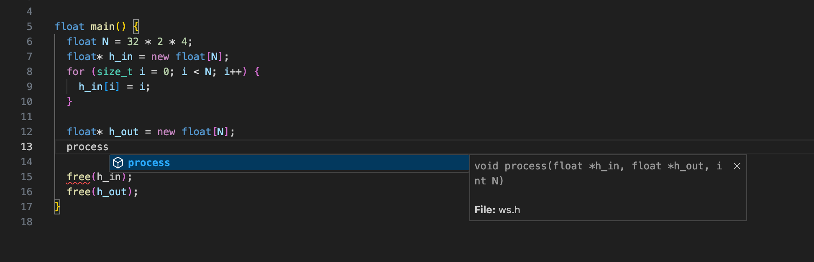

# How to make IntelliSense work
## Step 1: Configure correct `includePath`
Do not add too many paths to `includePath`.
For example,
```JSON
{
    "configurations": [
        {
            "name": "Linux",
            "includePath": [
                "/usr/include/**",
                "/usr/lib/gcc/x86_64-pc-linux-gnu/10.1.0/include",
                "${workspaceFolder}/cpp3rdlib/tensorflow/**"
            ],
            "defines": [
                "GOOGLE_CUDA"
            ],
            "compilerPath": "/usr/bin/gcc",
            "cStandard": "c11",
            "cppStandard": "c++17",
            "intelliSenseMode": "${default}",
            "compileCommands": "${workspaceFolder}/build64_release/compile_commands.json",
            "browse": {
                "databaseFilename": "${workspaceFolder}/.vscode/vc.db",
                "limitSymbolsToIncludedHeaders": false
            }
        }
    ],
    "version": 4
}
```

## Step 2: Fix all errors in `PROBLEMS` tab
Ref: 

## Step 3: Double-check
IntelliSense should show suggestions as follows:

